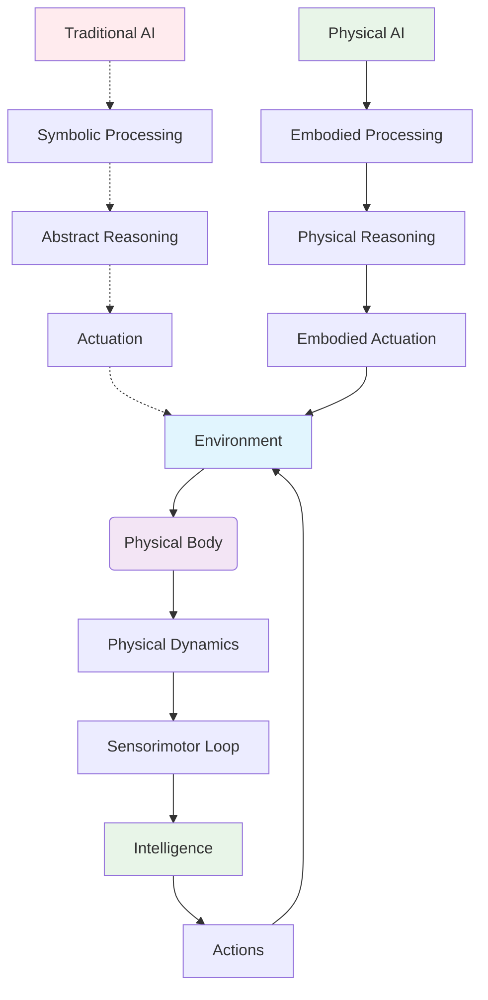
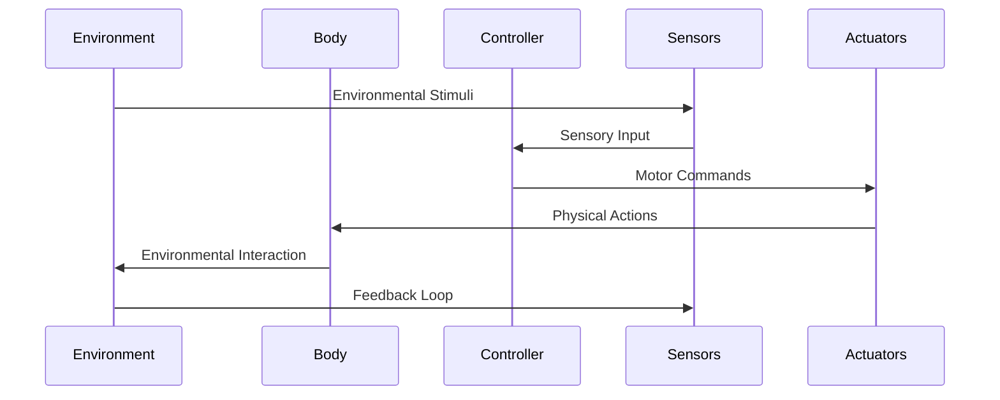
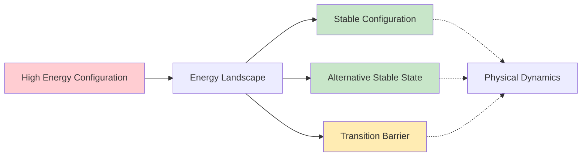
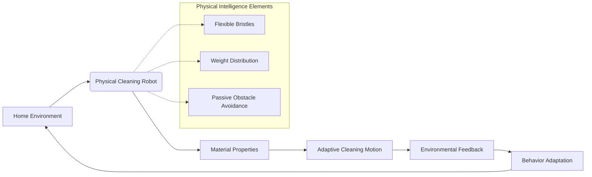

# 1.3 Physical AI Frameworks - Diagrams & Exercises

<div class="chapter-intro">

## What This Chapter Unlocks
Visual frameworks for understanding Physical AI systems. Through detailed diagrams, architectural models, and interactive exercises, you'll develop spatial and systems thinking essential for designing embodied intelligence.

**Skills You'll Gain**: Visual analysis of Physical AI systems, architectural thinking, and diagram-based reasoning for robotics design.

**Real-World Relevance**: Professional robotics engineers use these visualization techniques to design, debug, and optimize complex physical AI systems.

</div>

## Learning Objectives
- Visualize Physical AI concepts through diagrams and models
- Apply Physical AI frameworks to new scenarios
- Practice implementing Physical AI principles through exercises
- Develop intuition for embodied intelligence through interactive examples

## Physical AI Conceptual Framework



### The Action-Perception Cycle



## Physical AI Architecture Patterns

### 1. Embodied Cognitive Architecture

```
┌─────────────────────────────────────────────────────────────┐
│                    Physical AI System                       │
├─────────────────────────────────────────────────────────────┤
│  ┌─────────────┐    ┌─────────────┐    ┌─────────────┐     │
│  │   Physical  │    │   Control   │    │   Learning  │     │
│  │    Body     │◄──►│  System     │◄──►│  System     │     │
│  │             │    │             │    │             │     │
│  │ • Material  │    │ • Action-   │    │ • Adaptive  │     │
│  │   Properties│    │   Perception│    │   Behavior  │     │
│  │ • Dynamics  │    │ • Physics   │    │ • Morpho-   │     │
│  │ • Sensors   │    │   Engine    │    │   logical   │     │
│  │ • Actuators │    │ • Embodied  │    │   Learning  │     │
│  └─────────────┘    │   Control   │    └─────────────┘     │
│                     └─────────────┘                        │
└─────────────────────────────────────────────────────────────┘
```

### 2. Morphological Computation Model

```
┌─────────────────────────────────────────────────────────────┐
│              Morphological Computation                      │
├─────────────────────────────────────────────────────────────┤
│  Input    │ Physical Body │ Output from Computation        │
│    ↓      │      ↓        │            ↓                   │
│  Signal   │  ┌─────────┐  │  Result                      │
│    →      │  │Material │  │      ←                        │
│           │  │Behavior │  │                               │
│           │  │ • Flex  │  │                               │
│           │  │ • Soft  │  │                               │
│           │  │ • Joint │  │                               │
│           │  │ • Link  │  │                               │
│           │  └─────────┘  │                               │
│           │  ┌─────────┐  │                               │
│           │  │Dynamics │  │                               │
│           │  │ • Swing │  │                               │
│           │  │ • Bounce│  │                               │
│           │  │ • Flow  │  │                               │
│           │  └─────────┘  │                               │
│           │  ┌─────────┐  │                               │
│           │  │Physics  │  │                               │
│           │  │ • Mass  │  │                               │
│           │  │ • Inert.│  │                               │
│           │  │ • Frict.│  │                               │
│           │  └─────────┘  │                               │
│           │               │                               │
│  Minimal  │   Physical    │  Rich Behavioral             │
│  Control  │   Computation │  Output                      │
└─────────────────────────────────────────────────────────────┘
```

## Mathematical Framework for Physical AI

### State-Space Representation

For Physical AI systems, the state-space model includes both computational and physical components:

```
dx/dt = f(x, u, θ, t)     (Physical dynamics)
dy/dt = g(y, x, u, φ, t)  (Computational dynamics)
z = h(x, y, t)            (Sensor outputs)
```

Where:
- `x` represents physical state (positions, velocities, forces)
- `y` represents computational state (internal representations)
- `u` represents control inputs
- `θ` represents physical parameters (mass, friction, etc.)
- `φ` represents computational parameters (network weights, etc.)
- `z` represents sensor outputs

### Energy-Based Framework

Physical AI systems can be understood through energy landscapes:



## Case Study Analysis Diagrams

### 1. Passive Dynamic Walker Analysis

```
Terrain Adaptation in Passive Walkers:

Flat Ground:     Gentle Slope:     Rough Terrain:
  /‾‾‾‾\            /‾‾‾‾\           /‾‾‾‾‾\
 /      \          /      \         /   /\  \
/        \        /        \       /   /  \  \
──────────        ──────────       ───/────\──
 Stable gait     Natural adaptation  Adapted motion
 (exploits       (gravity assists   (physical
  dynamics)       forward motion)    compliance)
```

### 2. Tactile Learning Process

```
Tactile Learning Loop:

    Object Presentation
           ↓
    Grasp Execution
           ↓
   Tactile Feedback Collection
           ↓
    Feature Extraction
           ↓
   Property Classification
           ↓
  Grasp Optimization
           ↓
    (Back to top)
```

## Interactive Exercise Framework

### Exercise 1: Design a Physical AI System

**Scenario**: Design a robot to navigate and clean a home environment.

**Requirements**:
- Use minimal computational resources
- Exploit physical dynamics for efficiency
- Demonstrate morphological computation
- Include environmental interaction

**Solution Framework**:



**Physical Design Considerations**:
- **Flexible components** for obstacle adaptation
- **Weight distribution** for stability
- **Material compliance** for safe interaction
- **Passive dynamics** for energy efficiency

### Exercise 2: Analyze Morphological Computation

**Task**: Identify how the following physical properties can perform computation:

1. **Spring-mass system**: Can perform filtering and resonance
2. **Pendulum dynamics**: Can perform timing and rhythm processing
3. **Fluid dynamics**: Can perform flow-based computation
4. **Compliant materials**: Can perform shape matching and adaptation

**Solution Example**:
```
Compliant Gripper:
  Input: Various object shapes
  Physical Process: Material deformation under contact forces
  Computation: Shape adaptation and grasp optimization
  Output: Successful grasp of diverse objects
```

### Exercise 3: Action-Perception Loop Design

Design an action-perception loop for a robot learning to stack blocks:

```
┌─────────────────┐    ┌──────────────────┐    ┌─────────────────┐
│  Robot Action   │───▶│ Environmental    │───▶│  Perception     │
│  • Reach &      │    │  Response        │    │  • Visual       │
│    Grasp       │    │  • Block falls   │    │    Feedback     │
│  • Adjust      │    │  • Stack        │    │  • Tactile      │
│    Position    │    │    Stability    │    │    Sensing      │
└─────────────────┘    └──────────────────┘    └─────────────────┘
         ▲                                           │
         │                                           │
         │                                           ▼
┌─────────────────┐    ┌──────────────────┐    ┌─────────────────┐
│ Learning &      │◀───│ Physical         │◀───│ Error/Success   │
│ Adaptation      │    │ Consequences     │    │ Assessment      │
│ • Update grasp  │    │ • Successful     │    │ • Was stack     │
│   strategy      │    │   stacking       │    │   successful?   │
│ • Refine        │    │ • Failed attempt │    │ • How stable?   │
│   motions       │    │ • Block damage   │    │ • Any errors?   │
└─────────────────┘    └──────────────────┘    └─────────────────┘
```

## Design Pattern Exercises

### Pattern 1: Exploit Physical Dynamics

**Exercise**: Design a robot that uses gravity to assist in object manipulation.

**Solution Framework**:
- **Physical Setup**: Robot with moveable arms and a tiltable workspace
- **Dynamic Exploitation**: Use gravity to move objects into position
- **Control Strategy**: Minimal actuation, maximum passive dynamics
- **Benefits**: Energy efficiency, robustness, simplicity

### Pattern 2: Environmental Interaction

**Exercise**: Design a robot that uses the environment to compute solutions.

**Example Solution**: Sorting robot using environmental geometry
```
Environment-assisted sorting:
  Objects roll down inclined plane
  Geometric obstacles filter by size/shape
  Gravity provides the sorting force
  Robot only needs to start and collect
```

### Pattern 3: Material Intelligence

**Exercise**: Design a gripper that adapts to object properties through material properties.

**Solution**:
- **Variable Compliance**: Different parts of gripper have different stiffness
- **Shape Memory**: Material adapts to object contours
- **Friction Variation**: Surface properties adjust to object materials
- **Self-Adaptation**: No active control needed for basic grasping

## Assessment Questions

1. **Diagramming Exercise**: Draw the action-perception loop for a ball-balancing robot, highlighting where physical and computational processes occur.

2. **Analysis Exercise**: Given a specific task (e.g., opening doors), identify at least three ways physical dynamics could be exploited.

3. **Design Exercise**: Create a physical AI solution for a simple manipulation task, including material properties, environmental interactions, and computational components.

4. **Comparison Exercise**: Contrast traditional AI and Physical AI approaches for the same problem, showing the advantages of embodiment.

## Summary

This section has provided visual frameworks and practical exercises for understanding Physical AI concepts. The diagrams illustrate the core principles of embodied intelligence, morphological computation, and environmental interaction. The exercises provide hands-on opportunities to apply these concepts to real design challenges.

The key insight is that Physical AI leverages the tight coupling between physical bodies, environmental interaction, and computational processes to create more efficient, robust, and adaptive intelligent systems.

## References & Further Reading

- Pfeifer, R., & Bongard, J. (2006). How the Body Shapes the Way We Think
- Siciliano, B., & Khatib, O. (2016). Springer Handbook of Robotics
- Dudek, G., & Jenkin, M. (2010). Computational Principles of Mobile Robotics
- Iida, F., & Nagai, T. (2016). Morphological Computation

## Lab Exercise: Physical AI Simulation

Create a simple simulation demonstrating physical intelligence:

1. Implement a simple physical system (e.g., pendulum, spring-mass)
2. Add sensory feedback
3. Implement a minimal control system
4. Observe how physical dynamics contribute to "intelligent" behavior
5. Compare with a purely computational approach