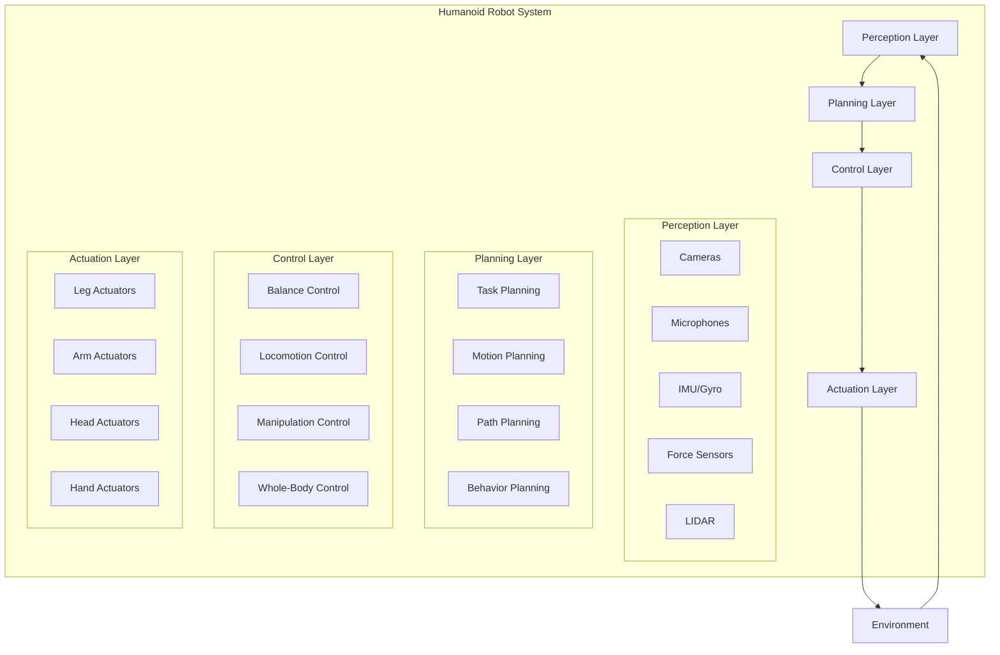
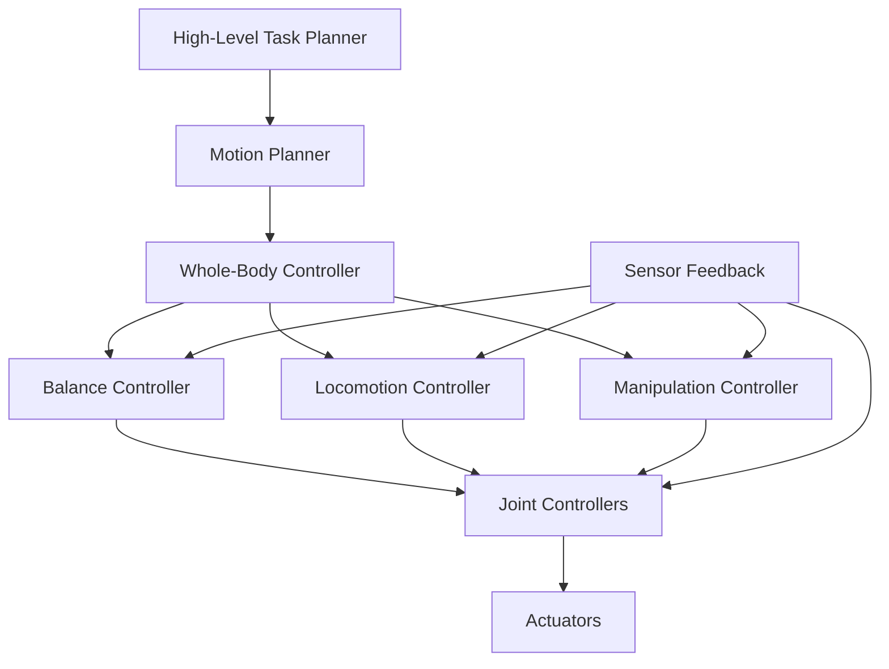
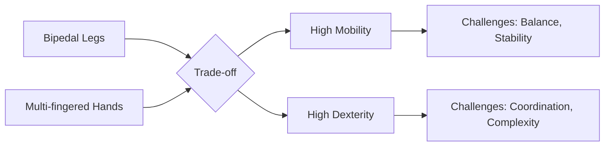
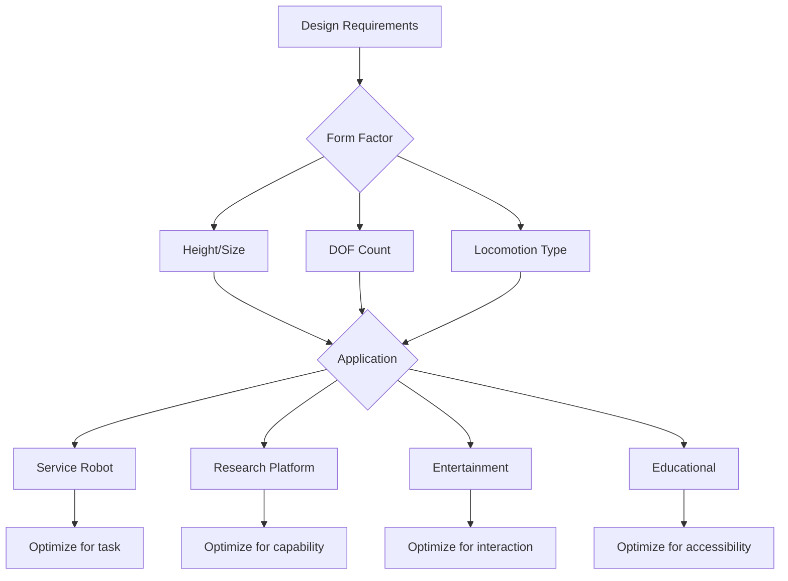
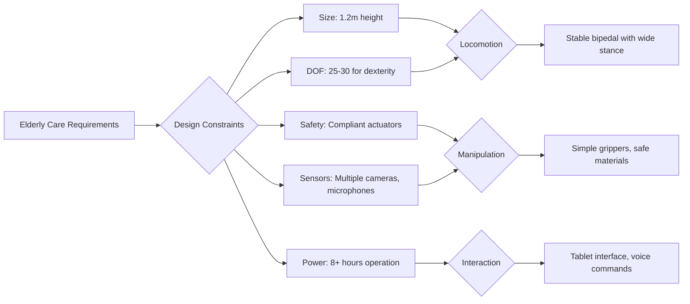

# 2.3 Humanoid Robot Design - Diagrams & Exercises

## Learning Objectives
- Visualize humanoid robot design principles through diagrams and models
- Apply design frameworks to humanoid robot development
- Practice design exercises for humanoid robot systems
- Analyze trade-offs in humanoid robot design through interactive examples

## Humanoid Robot Architecture Framework



## Humanoid Robot Kinematic Structure

### Complete Kinematic Chain
```
                    [Humanoid Robot Kinematic Structure]

                              Torso
                              /  |  \
                            /    |    \
                          /      |      \
                        /        |        \
                      /          |          \
                    /            |            \
                 Head(2DOF)   Waist(2DOF)   Sensors
                 /   |   \                   /  |  \
               /     |     \               /    |    \
             /       |       \           /      |      \
           /         |         \       /        |        \
      Left Arm    Center      Right Arm  Cameras  Microphones  IMU
      (7DOF)       Mass       (7DOF)     (2)      (4)        (1)
      /   |   \               /   |   \
    /     |     \           /     |     \
  /       |       \       /       |       \
Shoulder  Elbow   Wrist  Shoulder  Elbow   Wrist
 (3DOF)  (1DOF)  (2DOF)  (3DOF)  (1DOF)  (2DOF)

Left Leg (6DOF)              Right Leg (6DOF)
/   |   \                    /   |   \
Hip  Knee  Ankle           Hip  Knee  Ankle
(3DOF)(1DOF)(2DOF)        (3DOF)(1DOF)(2DOF)
```

### Joint Configuration Matrix
```
Joint Configuration by Body Part:

┌─────────────────────────────────────────────────────────────┐
│                    Joint Configuration                      │
├─────────────────────────────────────────────────────────────┤
│ Body Part    │ Joints (DOF)              │ Total DOF       │
├─────────────────────────────────────────────────────────────┤
│ Head         │ Yaw (1), Pitch (1)        │ 2               │
│ Torso        │ Waist Yaw (1), Pitch (1)  │ 2               │
│ Left Arm     │ 3 Shoulder + 1 Elbow +    │ 7               │
│              │ 2 Wrist                   │                 │
│ Right Arm    │ 3 Shoulder + 1 Elbow +    │ 7               │
│              │ 2 Wrist                   │                 │
│ Left Leg     │ 3 Hip + 1 Knee + 2 Ankle │ 6               │
│ Right Leg    │ 3 Hip + 1 Knee + 2 Ankle │ 6               │
├─────────────────────────────────────────────────────────────┤
│ Total        │                           │ 30 DOF minimum  │
└─────────────────────────────────────────────────────────────┘
```

## Control Architecture Diagrams

### Hierarchical Control System


### Balance Control Framework
```
Balance Control Architecture:

┌─────────────────────────────────────────────────────────────┐
│                    Balance Control System                   │
├─────────────────────────────────────────────────────────────┤
│  ┌─────────────────┐    ┌─────────────────┐                │
│  │   State Estimator│    │  ZMP Controller │                │
│  │   • CoM tracking│◄───┤  • Foot placement│                │
│  │   • Orientation │    │  • CoM control  │                │
│  │   • Velocity    │    │  • Momentum     │                │
│  └─────────────────┘    │  • Stability    │                │
│         │                └─────────────────┘                │
│         ▼                       │                           │
│  ┌─────────────────┐            ▼                           │
│  │   Trajectory    │    ┌─────────────────┐                │
│  │   Generator     │───►│   Feedback      │                │
│  │   • Desired CoM │    │   Controller    │                │
│  │   • Desired ZMP │    │   • Joint torques│                │
│  │   • Walking     │    │   • Actuator    │                │
│  │   • Balance     │    │   • Safety      │                │
│  └─────────────────┘    │   • Recovery    │                │
│                         └─────────────────┘                │
└─────────────────────────────────────────────────────────────┘
```

## Design Trade-off Analysis

### Mobility vs. Dexterity Trade-off


### Performance vs. Safety Matrix
```
Performance vs. Safety Trade-offs:

┌─────────────────────────────────────────────────────────────┐
│                Performance vs. Safety Matrix                │
├─────────────────────────────────────────────────────────────┤
│ High Performance │ • Fast movements                       │
│                  │ • Dynamic behaviors                     │
│                  │ • High power actuators                  │
│                  │ • Complex behaviors                     │
├─────────────────────────────────────────────────────────────┤
│ High Safety      │ • Slow, controlled movements           │
│                  │ • Compliant actuators                   │
│                  │ • Conservative behaviors                │
│                  │ • Multiple safety systems               │
├─────────────────────────────────────────────────────────────┤
│ Design Challenge │ Balance performance and safety based    │
│                  │ on application requirements             │
└─────────────────────────────────────────────────────────────┘
```

## Humanoid Robot Design Process

### Design Methodology Flow
```
Humanoid Robot Design Process:

[Requirements Analysis] ──→ [Conceptual Design]
         │                         │
         ▼                         ▼
[Functional Specification] ──→ [Preliminary Design]
         │                         │
         ▼                         ▼
[Detailed Design] ────────→ [Prototype Development]
         │                         │
         ▼                         ▼
[Testing & Validation] ────→ [Design Refinement]
         │                         │
         └─────────────────────────┘
```

### Design Decision Framework


## Kinematic Design Diagrams

### Inverse Kinematics Solution Space
```
IK Solution for Humanoid Arm:

┌─────────────────────────────────────────────────────────────┐
│                    Arm Inverse Kinematics                   │
├─────────────────────────────────────────────────────────────┤
│  Target Position: (x, y, z, roll, pitch, yaw)              │
│  ┌─────────────────────────────────────────────────────────┐│
│  │  Shoulder: θ₁, θ₂, θ₃ (3 DOF)                          ││
│  │  Elbow: θ₄ (1 DOF)                                     ││
│  │  Wrist: θ₅, θ₆ (2 DOF)                                 ││
│  │  ┌─────────────────────────────────────────────────────┐││
│  │  │  Solution 1: θ₁*, θ₂*, θ₃*, θ₄*, θ₅*, θ₆*         │││
│  │  │  Solution 2: θ₁**, θ₂**, θ₃**, θ₄**, θ₅**, θ₆**   │││
│  │  │  Solution 3: Multiple configurations possible      │││
│  │  └─────────────────────────────────────────────────────┘││
│  └─────────────────────────────────────────────────────────┘│
│  Constraints: Joint limits, collision avoidance,          │
│              physical feasibility                         │
└─────────────────────────────────────────────────────────────┘
```

### Bipedal Walking Pattern Generation
```
Walking Gait Cycle:

┌─────────────────────────────────────────────────────────────┐
│                    Walking Gait Analysis                    │
├─────────────────────────────────────────────────────────────┤
│  Double Support │  Single Support │  Double Support       │
│  Phase 1       │  Phase 2        │  Phase 3              │
│  (0-20%)       │  (20-80%)       │  (80-100%)           │
│  ┌─────────────┐┌─────────────────┐┌─────────────────────┐│
│  │Left foot     ││Swing leg       ││Right foot           ││
│  │contacts      ││moves forward    ││contacts             ││
│  │ground        ││while stance leg││ground               ││
│  │Right foot    ││supports body   ││Left foot            ││
│  │swings        ││weight          ││swings               ││
│  └─────────────┘└─────────────────┘└─────────────────────┘│
│  │             │ │               │ │                   │ │
│ 0%           20% │              80% │                 100% │
│                 │                 │                      │
│  ZMP Trajectory: ←──────────────────────────────────────→ │
│  CoM Trajectory:  ←────────────────────────────────────→ │
└─────────────────────────────────────────────────────────────┘
```

## Design Exercise Framework

### Exercise 1: Humanoid Robot Design for Specific Application

**Scenario**: Design a humanoid robot for elderly care assistance.

**Design Requirements**:
- Safe human interaction
- Object manipulation
- Navigation in home environments
- Social interaction capabilities
- Long operational time

**Solution Framework**:



**Physical Design Considerations**:
- **Material Safety**: Rounded edges, soft surfaces
- **Size Optimization**: Human-compatible dimensions
- **Power Efficiency**: Optimized for long operation
- **Reliability**: Minimal maintenance requirements

### Exercise 2: Balance Control Design

**Task**: Design a balance control system for a 30-DOF humanoid.

**Control Architecture**:
```
Balance Control System Design:

┌─────────────────────────────────────────────────────────────┐
│                    Multi-Level Balance Control              │
├─────────────────────────────────────────────────────────────┤
│  High-Level: Trajectory Planning                            │
│  • Desired CoM trajectory                                   │
│  • ZMP reference generation                                 │
│  • Step planning for recovery                               │
├─────────────────────────────────────────────────────────────┤
│  Mid-Level: Whole-Body Control                             │
│  • Inverse kinematics for balance                           │
│  • Task prioritization                                      │
│  • Contact force distribution                               │
├─────────────────────────────────────────────────────────────┤
│  Low-Level: Joint Control                                   │
│  • PID control for each joint                               │
│  • Motor current control                                    │
│  • Safety monitoring                                        │
└─────────────────────────────────────────────────────────────┘
```

### Exercise 3: Manipulation Design Challenge

**Scenario**: Design a manipulation system that can handle both delicate and heavy objects.

**Solution Approach**:
```
Adaptive Manipulation System:

┌─────────────────────────────────────────────────────────────┐
│                    Variable Stiffness Manipulation          │
├─────────────────────────────────────────────────────────────┤
│  Object Detection & Classification                          │
│  ↓                                                         │
│  Force/Torque Sensing                                       │
│  ↓                                                         │
│  Stiffness Adaptation                                       │
│  ↓                                                         │
│  Grasp Optimization                                         │
│  ↓                                                         │
│  Task Execution                                             │
└─────────────────────────────────────────────────────────────┘

Stiffness Control:
- Delicate objects: Compliant, low force
- Heavy objects: Stiff, high force
- Unknown objects: Adaptive based on feedback
```

## Design Pattern Exercises

### Pattern 1: Modular Design
**Exercise**: Design a modular humanoid robot where components can be easily replaced or upgraded.

**Solution Framework**:
```
Modular Humanoid Architecture:

┌─────────────────────────────────────────────────────────────┐
│                    Modular Design Pattern                   │
├─────────────────────────────────────────────────────────────┤
│  Standard Interfaces:                                       │
│  • Mechanical: Quick-connect joints                         │
│  • Electrical: Standardized power/data connectors           │
│  • Software: ROS-compliant message formats                  │
├─────────────────────────────────────────────────────────────┤
│  Module Types:                                              │
│  • Sensory modules: Replaceable sensors                     │
│  • Actuator modules: Interchangeable joints                 │
│  • Processing modules: Upgradable computers                 │
│  • Power modules: Replaceable batteries                     │
└─────────────────────────────────────────────────────────────┘
```

### Pattern 2: Safety-First Design
**Exercise**: Implement safety systems that ensure human safety in all operational modes.

**Solution**:
```
Safety-First Architecture:

┌─────────────────────────────────────────────────────────────┐
│                    Safety System Design                     │
├─────────────────────────────────────────────────────────────┤
│  Layer 1: Hardware Safety                                   │
│  • Compliant actuators                                      │
│  • Emergency stops                                          │
│  • Collision detection                                      │
├─────────────────────────────────────────────────────────────┤
│  Layer 2: Software Safety                                   │
│  • Speed limits                                             │
│  • Force limits                                             │
│  • Safety zones                                             │
├─────────────────────────────────────────────────────────────┤
│  Layer 3: Operational Safety                                │
│  • Supervised operation                                     │
│  • Training requirements                                    │
│  • Maintenance protocols                                    │
└─────────────────────────────────────────────────────────────┘
```

## Assessment Questions

1. **Diagramming Exercise**: Draw the complete control architecture for a humanoid robot performing a simple task (e.g., picking up a cup), showing all feedback loops and control levels.

2. **Analysis Exercise**: Given a specific application (e.g., factory assistance), identify the key design trade-offs and justify your design decisions.

3. **Design Exercise**: Create a detailed kinematic diagram for a humanoid robot arm with 7 DOF, including joint limits and workspace visualization.

4. **Integration Exercise**: Design how different subsystems (locomotion, manipulation, perception) would coordinate for a complex task like setting a table.

## Humanoid Robot Development Timeline

```
Development Phases:

Concept → Design → Prototype → Testing → Refinement → Production

Year 1: Requirements & Concept Design
  ↓
Year 2: Detailed Design & Component Selection
  ↓
Year 3: Prototype Development
  ↓
Year 4: Testing & Validation
  ↓
Year 5: Refinement & Production Preparation
```

## Cost-Benefit Analysis Framework

```
Cost-Benefit Analysis for Humanoid Robots:

┌─────────────────────────────────────────────────────────────┐
│                    Cost Factors                             │
├─────────────────────────────────────────────────────────────┤
│  Development Costs:                                         │
│  • R&D: $10M - $50M                                       │
│  • Tooling: $1M - $5M                                     │
│  • Testing: $2M - $10M                                    │
├─────────────────────────────────────────────────────────────┤
│  Production Costs:                                          │
│  • Per unit: $50K - $500K                                 │
│  • Maintenance: $5K - $20K annually                       │
├─────────────────────────────────────────────────────────────┤
│  Benefits:                                                  │
│  • Labor cost reduction                                     │
│  • 24/7 operation                                         │
│  • Consistent performance                                   │
│  • Risk reduction in hazardous environments                 │
└─────────────────────────────────────────────────────────────┘
```

## Summary

This section has provided comprehensive diagrams and design exercises for understanding humanoid robot development. The visual frameworks illustrate the complex interconnections between mechanical design, control systems, and practical implementation considerations. The exercises provide hands-on opportunities to apply these concepts to real design challenges.

The key insight is that humanoid robot design requires balancing multiple competing requirements while maintaining safety, functionality, and cost-effectiveness.

## Lab Exercise: Humanoid Robot Simulation

Create a simulation demonstrating humanoid robot principles:

1. Implement a simple humanoid kinematic model
2. Add basic balance control
3. Implement a simple walking pattern
4. Add manipulation capabilities
5. Test in various scenarios
6. Analyze performance and limitations

## References & Further Reading

- Siciliano, B., & Khatib, O. (2016). Springer Handbook of Robotics
- Spong, M. W., Hutchinson, S., & Vidyasagar, M. (2006). Robot Modeling and Control
- Craig, J. J. (2005). Introduction to Robotics: Mechanics and Control
- Murray, R. M., Li, Z., & Sastry, S. S. (1994). A Mathematical Introduction to Robotic Manipulation