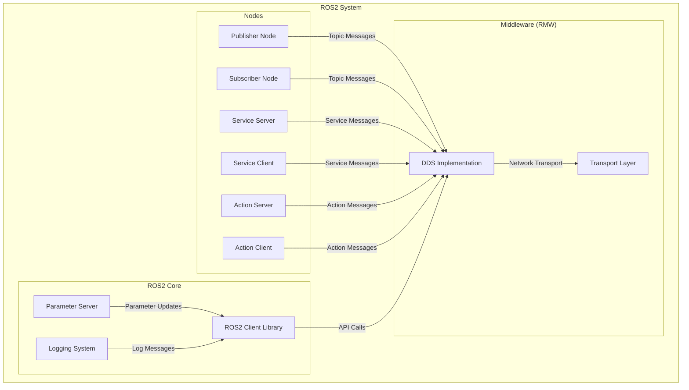
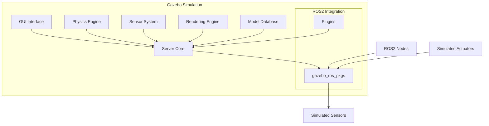
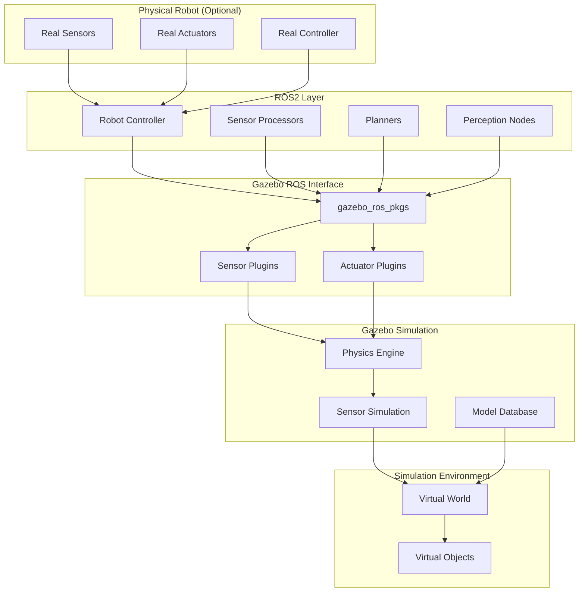
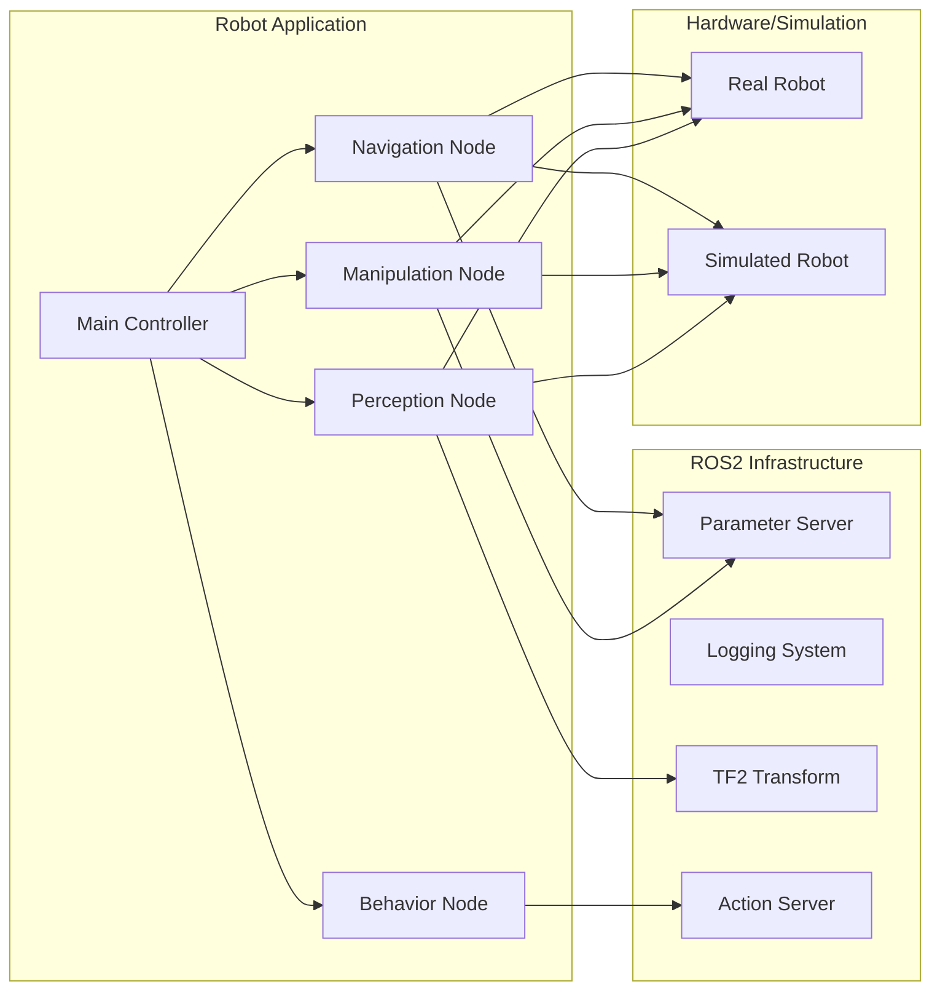
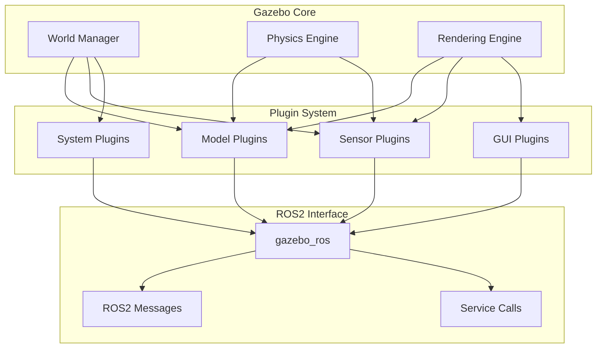
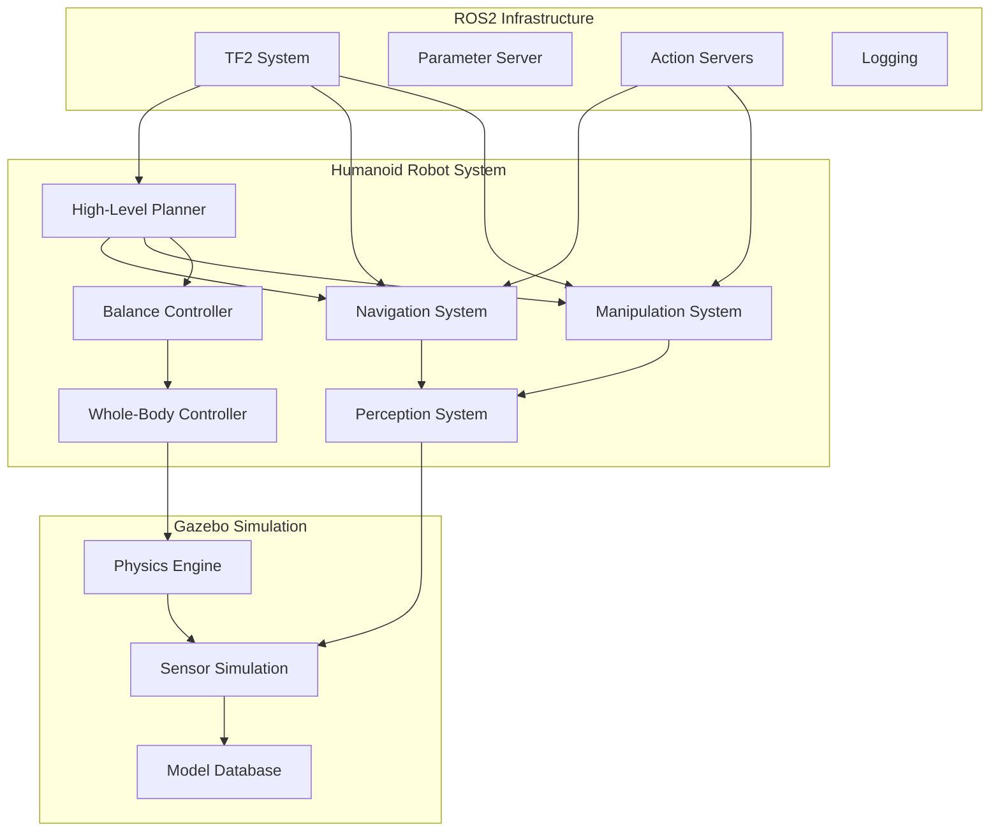
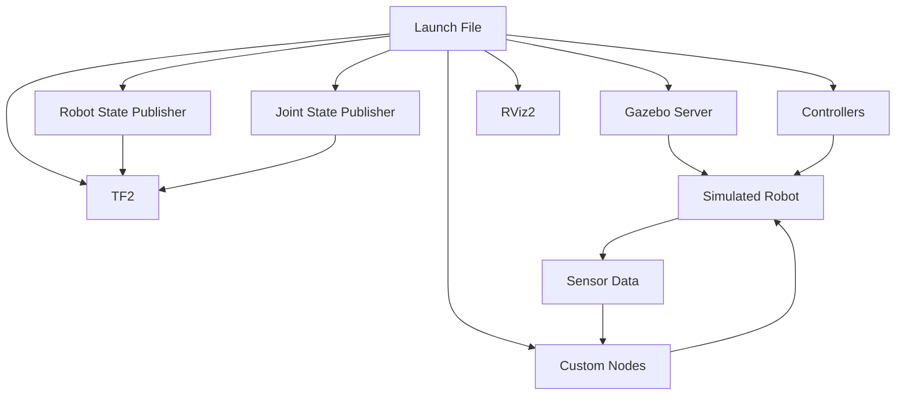

# 3.3 ROS2 and Gazebo Architecture - Diagrams & Exercises

## Learning Objectives
- Visualize ROS2 and Gazebo architecture through comprehensive diagrams
- Apply architectural patterns to robot system design
- Practice architecture design through interactive exercises
- Analyze system integration challenges through visual frameworks

## ROS2 Architecture Framework

### Overall System Architecture


### Node Communication Patterns
```
ROS2 Communication Architecture:

┌─────────────────────────────────────────────────────────────┐
│                    Communication Patterns                     │
├─────────────────────────────────────────────────────────────┤
│  Publisher/Subscriber Pattern:                              │
│  ┌─────────────┐              ┌─────────────┐               │
│  │ Publisher   │ ─ Topic ────▶│ Subscriber  │               │
│  │ (Sensor)    │              │ (Controller)│               │
│  └─────────────┘              └─────────────┘               │
│                                                             │
│  Service Request/Response Pattern:                          │
│  ┌─────────────┐    Request   ┌─────────────┐               │
│  │ Client      │ ────────────▶│ Server      │               │
│  │ (Planner)   │ ◀────────────│ (Database)  │               │
│  └─────────────┘   Response   └─────────────┘               │
│                                                             │
│  Action Goal/Feedback/Result Pattern:                       │
│  ┌─────────────┐    Goal      ┌─────────────┐               │
│  │ Client      │ ────────────▶│ Server      │               │
│  │ (Task)      │ ◀─ Feedback ─│ (Process)   │               │
│  └─────────────┘   Result ───▶│ (Robot)     │               │
│                              └─────────────┘               │
└─────────────────────────────────────────────────────────────┘
```

## Gazebo Simulation Architecture

### Simulation System Components


### Simulation Data Flow
```
Gazebo Data Flow Architecture:

┌─────────────────────────────────────────────────────────────┐
│                   Simulation Data Flow                      │
├─────────────────────────────────────────────────────────────┤
│  Time Step Loop:                                            │
│  ┌─────────────────┐    ┌─────────────────┐                │
│  │  Physics Update │───▶│  Sensor Update  │                │
│  │  • Forces       │    │  • Camera data  │                │
│  │  • Collisions   │    │  • LIDAR scans  │                │
│  │  • Dynamics     │    │  • IMU readings │                │
│  └─────────────────┘    └─────────────────┘                │
│           │                      │                          │
│           ▼                      ▼                          │
│  ┌─────────────────┐    ┌─────────────────┐                │
│  │  Control Input  │───▶│  Rendering      │                │
│  │  • Joint cmds   │    │  • 3D display   │                │
│  │  • Velocities   │    │  • GUI updates  │                │
│  └─────────────────┘    └─────────────────┘                │
└─────────────────────────────────────────────────────────────┘
```

## ROS2-Gazebo Integration Architecture

### Complete Integration Framework


### Message Flow Diagram
```
ROS2-Gazebo Message Flow:

┌─────────────────┐    ┌─────────────────┐    ┌─────────────────┐
│   ROS2 Nodes    │    │  Gazebo ROS     │    │   Gazebo        │
│                 │    │   Interface     │    │   Simulation    │
│ • sensor_msgs   │◄──►│ • gazebo_msgs   │◄──►│ • Sensor Data   │
│ • geometry_msgs │    │ • plugin_msgs   │    │ • Physics State │
│ • nav_msgs      │    │ • std_msgs      │    │ • Model States  │
│ • custom_msgs   │    │                 │    │ • Collisions    │
└─────────────────┘    └─────────────────┘    └─────────────────┘
        │                       │                       │
        ▼                       ▼                       ▼
┌─────────────────┐    ┌─────────────────┐    ┌─────────────────┐
│ Sensor Data     │    │ Message         │    │ Simulation      │
│ Processing      │    │ Conversion      │    │ State           │
│ (Camera, LIDAR, │    │ (ROS2 ↔ Gazebo) │    │ (Physics,       │
│ IMU, etc.)      │    │                 │    │  Rendering)     │
└─────────────────┘    └─────────────────┘    └─────────────────┘
```

## Robot Control Architecture Patterns

### Hierarchical Control Structure
```
Hierarchical Control Architecture:

┌─────────────────────────────────────────────────────────────┐
│                    Task Level (High Level)                  │
│  • Task planning                                            │
│  • High-level goals                                         │
│  • Behavior trees                                           │
│  • State machines                                           │
├─────────────────────────────────────────────────────────────┤
│                  Motion Level (Mid Level)                   │
│  • Trajectory generation                                    │
│  • Path planning                                            │
│  • Motion planning                                          │
│  • Inverse kinematics                                       │
├─────────────────────────────────────────────────────────────┤
│                 Control Level (Low Level)                   │
│  • PID control                                              │
│  • Joint position/velocity/torque control                   │
│  • Balance control                                          │
│  • Feedback control                                         │
├─────────────────────────────────────────────────────────────┤
│                Hardware Level (Lowest Level)                │
│  • Motor drivers                                            │
│  • Sensor interfaces                                        │
│  • Real-time execution                                      │
│  • Safety systems                                           │
└─────────────────────────────────────────────────────────────┘
```

### Modular Node Architecture


## Gazebo Model Architecture

### URDF to SDF Conversion Process
```
URDF/SDF Model Architecture:

┌─────────────────┐    ┌─────────────────┐    ┌─────────────────┐
│    URDF File    │───▶│   Conversion    │───▶│     SDF File    │
│  • Kinematics   │    │   Process       │    │  • Simulation   │
│  • Visuals      │    │                 │    │  • Physics      │
│  • Collisions   │    │                 │    │  • Materials    │
│  • Inertial     │    │                 │    │  • Plugins      │
└─────────────────┘    └─────────────────┘    └─────────────────┘
         │                       │                       │
         ▼                       ▼                       ▼
┌─────────────────┐    ┌─────────────────┐    ┌─────────────────┐
│  Robot Model    │    │  Gazebo Model   │    │  Simulation     │
│  • Links        │    │  • Entities     │    │  • Physics      │
│  • Joints       │    │  • Properties   │    │  • Rendering    │
│  • Materials    │    │  • Sensors      │    │  • Dynamics     │
└─────────────────┘    └─────────────────┘    └─────────────────┘
```

### Plugin Architecture


## Design Exercise Framework

### Exercise 1: Robot Architecture Design

**Scenario**: Design a ROS2-Gazebo architecture for a humanoid robot that performs navigation and manipulation tasks.

**Requirements**:
- Bipedal locomotion control
- Arm manipulation with 6 DOF arms
- Object recognition and grasping
- Navigation in dynamic environments
- Safety and collision avoidance

**Architecture Solution Framework**:



**Key Design Considerations**:
- **Balance Priority**: Balance control takes highest priority in whole-body control
- **Safety Integration**: Collision avoidance integrated at multiple levels
- **Modularity**: Independent modules for easy maintenance
- **Real-time Requirements**: Critical control loops at high frequency

### Exercise 2: Simulation Pipeline Design

**Task**: Design a complete simulation pipeline from sensor input to actuator output.

**Pipeline Architecture**:
```
Complete Simulation Pipeline:

┌─────────────────┐    ┌─────────────────┐    ┌─────────────────┐
│   Real Sensors  │    │  Simulation     │    │   Simulation    │
│   (Optional)    │    │   Sensors       │    │   Environment   │
│  • Cameras      │    │  • Camera       │    │  • World Model │
│  • LIDAR        │───▶│  • Ray sensors  │───▶│  • Objects     │
│  • IMU          │    │  • IMU          │    │  • Physics     │
│  • Force/Torque │    │  • GPS          │    │  • Dynamics    │
└─────────────────┘    └─────────────────┘    └─────────────────┘
         │                       │                       │
         ▼                       ▼                       ▼
┌─────────────────┐    ┌─────────────────┐    ┌─────────────────┐
│  Sensor Fusion  │    │   Perception    │    │  Physics        │
│  & Processing   │───▶│   Algorithms    │───▶│   Simulation    │
│  • Calibration  │    │  • Object       │    │  • Collision    │
│  • Filtering    │    │    Detection    │    │    Detection   │
│  • Integration  │    │  • SLAM         │    │  • Dynamics     │
└─────────────────┘    └─────────────────┘    └─────────────────┘
         │                       │                       │
         ▼                       ▼                       ▼
┌─────────────────┐    ┌─────────────────┐    ┌─────────────────┐
│   Decision      │    │   Motion        │    │   Actuator      │
│   Making        │───▶│   Control       │───▶│   Simulation    │
│  • Path Planning │    │  • Trajectory   │    │  • Joint        │
│  • Task Planning │    │    Generation   │    │    Control     │
│  • Behavior     │    │  • Inverse      │    │  • Dynamics     │
│    Selection    │    │    Kinematics   │    │    Integration │
└─────────────────┘    └─────────────────┘    └─────────────────┘
         │                       │                       │
         └───────────────────────┼───────────────────────┘
                                 ▼
                    ┌─────────────────┐
                    │  Real Actuators │
                    │   (Optional)    │
                    │  • Motors       │
                    │  • Servos       │
                    │  • Hydraulics   │
                    └─────────────────┘
```

### Exercise 3: Debugging Architecture

**Scenario**: Design a debugging and monitoring architecture for ROS2-Gazebo systems.

**Monitoring Framework**:
```
Debugging & Monitoring Architecture:

┌─────────────────────────────────────────────────────────────┐
│                    Monitoring Architecture                  │
├─────────────────────────────────────────────────────────────┤
│  ┌─────────────────┐    ┌─────────────────┐                │
│  │   ROS2 Nodes    │    │  Gazebo Server  │                │
│  │  • Publishers   │    │  • Simulation   │                │
│  │  • Subscribers  │    │    Status       │                │
│  │  • Services     │    │  • Physics      │                │
│  │  • Actions      │    │    Performance  │                │
│  └─────────────────┘    │  • Sensor       │                │
│         │                │    Data        │                │
│         ▼                └─────────────────┘                │
│  ┌─────────────────┐             │                          │
│  │   Message       │             ▼                          │
│  │   Monitoring    │    ┌─────────────────┐                │
│  │  • Topic Stats  │    │  Performance    │                │
│  │  • QoS Issues   │    │  Monitoring     │                │
│  │  • Connection   │    │  • CPU Usage    │                │
│  │    Status       │    │  • Memory       │                │
│  └─────────────────┘    │  • Simulation   │                │
│         │                │    Timing      │                │
│         ▼                └─────────────────┘                │
│  ┌─────────────────┐             │                          │
│  │   Visualization │             ▼                          │
│  │  • Rviz2        │    ┌─────────────────┐                │
│  │  • PlotJuggler  │    │   Logging       │                │
│  │  • Gazebo GUI   │    │  • Error logs   │                │
│  │  • Custom tools │    │  • Performance  │                │
│  └─────────────────┘    │  • Debug traces  │                │
│                         │  • Warnings      │                │
│                         └─────────────────┘                │
└─────────────────────────────────────────────────────────────┘
```

## Architecture Pattern Exercises

### Pattern 1: Publisher-Subscriber with Feedback
**Exercise**: Design a system where a controller publishes commands to a simulated robot and receives feedback.

**Solution**:
```
Command-Feedback Pattern:

Controller Node:
┌─────────────────────────────────────────────────────────────┐
│                    Controller Architecture                  │
├─────────────────────────────────────────────────────────────┤
│  1. Process high-level goal                                 │
│  2. Generate trajectory commands                            │
│  3. Publish to /joint_commands                              │
│  4. Subscribe to /joint_states for feedback                 │
│  5. Adjust commands based on feedback                       │
└─────────────────────────────────────────────────────────────┘

Message Flow:
[Goal] → [Controller] → [Joint Commands] → [Robot] → [Joint States] → [Controller] → [Adjusted Commands]
```

### Pattern 2: Service-Based Architecture
**Exercise**: Design a system where robot services are provided to external clients.

**Solution**:
```
Service-Based Pattern:

Service Provider:
┌─────────────────────────────────────────────────────────────┐
│                  Service Provider Architecture              │
├─────────────────────────────────────────────────────────────┤
│  • Listen on service topic (e.g., /move_to)                │
│  • Validate incoming requests                                │
│  • Plan trajectory to goal                                   │
│  • Execute movement in simulation                            │
│  • Return success/failure response                           │
└─────────────────────────────────────────────────────────────┘

Client Usage:
┌─────────────────────────────────────────────────────────────┐
│                     Client Architecture                     │
├─────────────────────────────────────────────────────────────┤
│  • Send service request with parameters                     │
│  • Wait for response                                        │
│  • Handle success/failure cases                             │
│  • Retry logic if needed                                    │
└─────────────────────────────────────────────────────────────┘
```

### Pattern 3: Action-Based Long-Running Tasks
**Exercise**: Design a system for complex manipulation tasks using actions.

**Solution**:
```
Action-Based Pattern:

Action Server:
┌─────────────────────────────────────────────────────────────┐
│                   Action Server Architecture                │
├─────────────────────────────────────────────────────────────┤
│  • Accept goal: grasp_object(target_x, target_y, target_z)  │
│  • Provide feedback: approach_progress, grasp_status        │
│  • Return result: success, failure_reason                   │
└─────────────────────────────────────────────────────────────┘

State Machine for Action:
[Waiting for Goal] → [Planning Approach] → [Moving to Object] → [Grasping] → [Verifying Grasp] → [Completed/Failed]
```

## System Integration Diagrams

### Launch File Architecture


### Parameter Configuration Architecture
```
Parameter Configuration:

┌─────────────────────────────────────────────────────────────┐
│                   Parameter Architecture                    │
├─────────────────────────────────────────────────────────────┤
│  Global Parameters:                                         │
│  • use_sim_time: true/false                                 │
│  • robot_description: URDF content                          │
│  • default_velocities: [0, 0, 0]                           │
├─────────────────────────────────────────────────────────────┤
│  Node-Specific Parameters:                                  │
│  • Controller: max_velocity, acceleration limits            │
│  • Sensor: update_rate, range, noise parameters             │
│  • Planner: resolution, timeout, algorithm settings         │
├─────────────────────────────────────────────────────────────┤
│  Environment Parameters:                                    │
│  • gravity: [0, 0, -9.81]                                  │
│  • physics_engine: ode, bullet, etc.                        │
│  • simulation_step: 0.001 (seconds)                         │
└─────────────────────────────────────────────────────────────┘
```

## Assessment Questions

1. **Architecture Exercise**: Draw the complete data flow for a humanoid robot performing a pick-and-place task, showing all ROS2 nodes, topics, and Gazebo components involved.

2. **Design Challenge**: Create an architectural diagram for a multi-robot system in Gazebo where robots coordinate to achieve a common goal.

3. **Integration Exercise**: Design a ROS2-Gazebo system that can seamlessly switch between simulation and real hardware with minimal code changes.

4. **Performance Exercise**: Design a monitoring architecture that can detect and report performance bottlenecks in a complex ROS2-Gazebo system.

## Security Architecture Considerations

```
Security Architecture:

┌─────────────────────────────────────────────────────────────┐
│                     Security Framework                      │
├─────────────────────────────────────────────────────────────┤
│  Communication Security:                                    │
│  • DDS Security plugins                                     │
│  • Network segmentation                                     │
│  • Authentication mechanisms                                │
├─────────────────────────────────────────────────────────────┤
│  Data Security:                                             │
│  • Message encryption                                       │
│  • Access control lists                                     │
│  • Parameter protection                                     │
├─────────────────────────────────────────────────────────────┤
│  Physical Security:                                         │
│  • Emergency stops                                          │
│  • Safety zones                                             │
│  • Collision prevention                                     │
└─────────────────────────────────────────────────────────────┘
```

## Summary

This section has provided comprehensive architectural diagrams and design exercises for ROS2 and Gazebo systems. The visual frameworks illustrate the complex interconnections between different system components and provide patterns for building robust robotic systems. The exercises provide hands-on opportunities to apply architectural concepts to real design challenges.

The key insight is that successful ROS2-Gazebo integration requires careful architectural planning that considers communication patterns, performance requirements, safety considerations, and modularity for maintenance and extension.

## Lab Exercise: Complete System Architecture

Design and implement a complete ROS2-Gazebo architecture for a specific robotic task:

1. **Define requirements**: Identify the specific robot capabilities needed
2. **Design architecture**: Create node structure and communication patterns
3. **Implement components**: Build individual ROS2 nodes
4. **Create simulation**: Design Gazebo world and robot model
5. **Integrate system**: Connect all components and test
6. **Validate performance**: Measure system performance and reliability
7. **Document architecture**: Create architectural diagrams and documentation

## References & Further Reading

- ROS2 Design: https://design.ros2.org/
- Gazebo Documentation: https://gazebosim.org/
- ROS2 Tutorials: http://docs.ros.org/en/humble/Tutorials.html
- Gazebo Tutorials: https://classic.gazebosim.org/tutorials
- Siciliano, B., & Khatib, O. (2016). Springer Handbook of Robotics