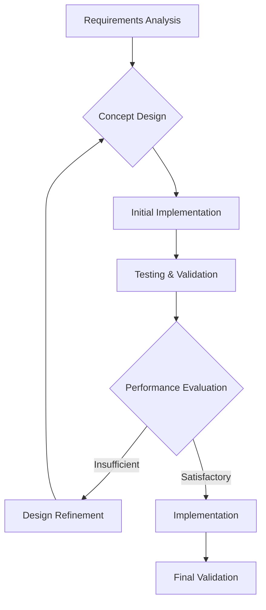

# 1.2 Humanoid Robot Design - Practical Implementation

## Learning Objectives
- Implement practical humanoid robot design methodologies
- Analyze real-world design implementations and their outcomes
- Evaluate trade-offs in practical humanoid robot development
- Apply design principles to specific implementation scenarios
- Understand the challenges and solutions in practical humanoid robot design

## Introduction

This section examines the practical aspects of implementing humanoid robot designs, focusing on real-world challenges, solutions, and methodologies that bridge the gap between theoretical design principles and functional robots. We'll explore how design decisions translate into actual mechanical systems, control architectures, and operational capabilities.

## Case Study 1: ASIMO by Honda - Engineering Implementation

### Mechanical Design Implementation

Honda's ASIMO represents decades of practical humanoid robot implementation, demonstrating real-world solutions to complex design challenges:

#### Joint Implementation Strategy
```cpp
// ASIMO's joint control implementation
class ASIMOJointController {
private:
    std::vector<MotorController> joint_motors;
    std::vector<Encoder> joint_encoders;
    std::vector<LoadSensor> joint_loads;

public:
    // High-level joint control
    void controlJoint(int joint_id, double target_position, double stiffness) {
        // Calculate control effort based on position error
        double current_pos = joint_encoders[joint_id].getPosition();
        double error = target_position - current_pos;

        // Apply variable stiffness control
        double torque = calculatePDControl(error) + stiffness * calculateCompliance(error);

        // Apply torque limit based on safety requirements
        torque = limitTorque(torque, joint_id);

        joint_motors[joint_id].setTorque(torque);
    }

    // Safety-critical functions
    void emergencyStop() {
        for (auto& motor : joint_motors) {
            motor.setTorque(0.0);
        }
        // Activate mechanical brakes if available
        activateMechanicalBrakes();
    }
};
```

#### Balance Control Implementation
ASIMO implemented sophisticated balance control through ZMP (Zero Moment Point) control:

```python
class ZMPBalanceController:
    def __init__(self):
        self.imu = IMU()
        self.ft_sensors = ForceTorqueSensors()
        self.kinematics = KinematicsModel()

        # ZMP calculation parameters
        self.com_height = 0.7  # Center of mass height in meters
        self.gravity = 9.81

        # Control gains
        self.zmp_p_gain = 5.0
        self.zmp_d_gain = 1.0

    def calculateZMP(self, forces, moments):
        """Calculate Zero Moment Point from force/torque measurements"""
        # ZMP_x = (M_y + F_z * CoM_height) / F_z
        # ZMP_y = (-M_x + F_z * CoM_height) / F_z

        fz = forces[2]  # Vertical force
        if abs(fz) > 0.1:  # Ensure sufficient normal force
            zmp_x = (moments[1] + forces[2] * self.com_height) / forces[2]
            zmp_y = (-moments[0] + forces[2] * self.com_height) / forces[2]
            return (zmp_x, zmp_y)
        else:
            return (0, 0)  # Invalid when no ground contact

    def balanceControl(self, current_zmp, target_zmp):
        """Adjust joint commands to maintain balance"""
        zmp_error = (target_zmp[0] - current_zmp[0],
                     target_zmp[1] - current_zmp[1])

        # Use inverse kinematics to adjust for balance
        balance_adjustment = self.calculateBalanceIK(zmp_error)

        return balance_adjustment
```

### Implementation Challenges and Solutions

#### Challenge 1: Weight Distribution
**Problem**: Early humanoid robots were top-heavy and unstable.
**Solution**: Honda implemented:
- Lowered center of gravity through careful component placement
- Distributed mass throughout the body structure
- Optimized limb design for weight reduction

#### Challenge 2: Power Management
**Problem**: High power consumption limited operational time.
**Solution**:
- Efficient motor control algorithms
- Regenerative braking systems
- Optimized walking patterns to reduce energy consumption

#### Challenge 3: Heat Dissipation
**Problem**: High-torque actuators generated significant heat.
**Solution**:
- Integrated cooling systems
- Heat-dissipating materials and structures
- Duty cycle management to prevent overheating

## Case Study 2: NAO by SoftBank Robotics - Commercial Implementation

### Modular Design Implementation

NAO demonstrates successful commercial humanoid robot implementation with a focus on modularity and reliability:

#### Hardware Architecture
```xml
<!-- NAO's modular architecture implementation -->
<robot name="nao_robot">
  <!-- Head module -->
  <link name="Head">
    <inertial>
      <mass value="0.5"/>
      <origin xyz="0 0 0.05"/>
      <inertia ixx="0.001" ixy="0" ixz="0" iyy="0.001" iyz="0" izz="0.001"/>
    </inertial>
  </link>

  <!-- Joint definitions with safety limits -->
  <joint name="HeadYaw" type="revolute">
    <parent link="Torso"/>
    <child link="Head"/>
    <origin xyz="0 0 0.1265"/>
    <axis xyz="0 0 1"/>
    <limit lower="-2.09" upper="2.09" effort="10" velocity="5.1"/>
    <safety_controller k_position="10" k_velocity="1" soft_lower_limit="-2.0" soft_upper_limit="2.0"/>
  </joint>

  <!-- Implementation of compliant control -->
  <transmission name="HeadYaw_trans">
    <type>transmission_interface/SimpleTransmission</type>
    <joint name="HeadYaw">
      <hardwareInterface>PositionJointInterface</hardwareInterface>
    </joint>
    <actuator name="HeadYaw_motor">
      <mechanicalReduction>1</mechanicalReduction>
      <hardwareInterface>PositionJointInterface</hardwareInterface>
    </actuator>
  </transmission>
</robot>
```

#### Software Architecture
```python
# NAO's behavior implementation
class NAOBehaviorEngine:
    def __init__(self):
        self.motion = ALMotion()
        self.vision = ALVideoDevice()
        self.audio = ALAudioDevice()
        self.leds = ALLeds()
        self.sensors = ALSensors()

        # State machine for behavior management
        self.state_machine = self.initializeStateMachine()

    def initializeStateMachine(self):
        """Initialize behavior state machine"""
        states = {
            'IDLE': self.idle_behavior,
            'ENGAGED': self.engaged_behavior,
            'INTERACTING': self.interacting_behavior,
            'LEARNING': self.learning_behavior
        }
        return states

    def idle_behavior(self):
        """Default behavior when not engaged"""
        # Gentle head movements to appear alive
        self.move_head_gently()

        # Periodic eye color changes
        self.cycle_leds()

        # Listen for engagement signals
        if self.detect_human_presence():
            return 'ENGAGED'

        return 'IDLE'

    def move_head_gently(self):
        """Perform gentle head movements"""
        head_yaw = math.sin(time.time() * 0.2) * 0.1
        head_pitch = 0.1 + math.sin(time.time() * 0.3) * 0.05

        self.motion.setAngles(['HeadYaw', 'HeadPitch'], [head_yaw, head_pitch], 0.1)
```

### Commercial Implementation Considerations

#### Manufacturing Optimization
NAO's commercial success required:
- **Standardized components**: Reduced manufacturing costs
- **Tool-free assembly**: Simplified maintenance
- **Quality control**: Consistent performance across units
- **Scalability**: Manufacturing process suitable for high volume

#### User Experience Design
- **Approachable appearance**: Rounded edges, friendly design
- **Intuitive interaction**: Simple voice and gesture commands
- **Educational value**: Clear feedback and learning opportunities
- **Reliability**: Minimal maintenance requirements

## Case Study 3: Atlas by Boston Dynamics - High-Performance Implementation

### Advanced Control Implementation

Atlas represents the pinnacle of high-performance humanoid robot implementation:

#### Model Predictive Control (MPC)
```python
import numpy as np
from scipy.optimize import minimize

class AtlasMPCController:
    def __init__(self):
        self.state_dim = 12  # Position, velocity, orientation, angular velocity
        self.control_dim = 12  # Joint torques or forces
        self.prediction_horizon = 20  # Number of prediction steps

    def setup_optimization_problem(self, current_state, desired_trajectory):
        """Setup MPC optimization problem"""

        def cost_function(controls):
            total_cost = 0
            state = current_state.copy()

            for k in range(self.prediction_horizon):
                # Propagate state forward
                next_state = self.dynamics_model(state, controls[k:k+self.control_dim])

                # Calculate stage cost
                state_error = next_state - desired_trajectory[k]
                control_effort = controls[k:k+self.control_dim]

                stage_cost = (np.dot(state_error.T, np.dot(self.Q_matrix, state_error)) +
                             np.dot(control_effort.T, np.dot(self.R_matrix, control_effort)))

                total_cost += stage_cost
                state = next_state

            return total_cost

        def dynamics_model(self, state, control):
            """Simplified dynamics model for prediction"""
            # This would include full robot dynamics
            # For brevity, simplified model shown
            next_state = state + self.dt * self.system_dynamics(state, control)
            return next_state

        return cost_function

    def compute_control(self, current_state, desired_trajectory):
        """Compute optimal control sequence"""
        # Initial guess for control sequence
        initial_controls = np.zeros(self.prediction_horizon * self.control_dim)

        # Optimization bounds (actuator limits)
        bounds = [(-self.max_torque, self.max_torque)
                 for _ in range(self.prediction_horizon * self.control_dim)]

        # Solve optimization problem
        result = minimize(
            self.setup_optimization_problem(current_state, desired_trajectory),
            initial_controls,
            method='SLSQP',
            bounds=bounds,
            options={'disp': False}
        )

        if result.success:
            # Return first control in sequence
            return result.x[:self.control_dim]
        else:
            # Fallback to safe control
            return np.zeros(self.control_dim)
```

#### Dynamic Movement Implementation
```python
class AtlasDynamicController:
    def __init__(self):
        self.whole_body_controller = WholeBodyController()
        self.contact_scheduler = ContactScheduler()
        self.mpc_controller = AtlasMPCController()

    def execute_dynamic_maneuver(self, maneuver_type, target):
        """Execute complex dynamic maneuvers"""

        if maneuver_type == 'jump':
            return self.execute_jump(target)
        elif maneuver_type == 'flip':
            return self.execute_flip(target)
        elif maneuver_type == 'parkour':
            return self.execute_parkour_sequence(target)

    def execute_jump(self, target):
        """Implement jumping maneuver"""
        # Phase 1: Pre-jump preparation
        self.pre_jump_posture()

        # Phase 2: Power generation
        self.generate_takeoff_force()

        # Phase 3: Flight control
        self.control_flight_phase()

        # Phase 4: Landing preparation
        self.prepare_for_landing()

        # Phase 5: Landing execution
        self.execute_landing()

    def pre_jump_posture(self):
        """Prepare robot for jump"""
        # Crouch position
        desired_angles = self.inverse_kinematics({
            'torso_height': 0.5,  # Lower center of mass
            'knee_angle': 1.0,    # Bent knees for spring
            'arm_position': 'ready'  # Arms ready for balance
        })

        self.whole_body_controller.move_to_configuration(desired_angles, duration=0.5)

    def generate_takeoff_force(self):
        """Generate upward force for takeoff"""
        # Synchronized leg extension
        forces = {
            'left_leg': [0, 0, 1500],  # Upward force in Newtons
            'right_leg': [0, 0, 1500], # Symmetric force
        }

        self.whole_body_controller.apply_forces(forces)
```

### Implementation Challenges for High-Performance Robots

#### Challenge 1: Real-Time Performance
**Problem**: Complex calculations must execute in real-time.
**Solutions**:
- Parallel processing architectures
- Optimized algorithms and data structures
- Real-time operating systems
- Predictive control to reduce computation load

#### Challenge 2: High-Power Actuation
**Problem**: Dynamic movements require high peak power.
**Solutions**:
- High-torque, high-speed actuators
- Power management systems
- Efficient mechanical design
- Advanced control algorithms

#### Challenge 3: Safety at High Speeds
**Problem**: High-energy movements pose safety risks.
**Solutions**:
- Multiple safety systems
- Predictive safety algorithms
- Containment strategies
- Emergency stop systems

## Practical Design Methodologies

### 1. Iterative Design Process

#### Design-Test-Refine Cycle


#### Implementation Guidelines
1. **Start Simple**: Begin with minimal viable functionality
2. **Validate Early**: Test basic principles before adding complexity
3. **Iterate Rapidly**: Short development cycles with frequent testing
4. **Document Lessons**: Capture learning for future iterations

### 2. Modularity-First Design

#### Component-Based Architecture
```python
class HumanoidRobot:
    def __init__(self, configuration):
        # Modular component initialization
        self.sensors = SensorModule(configuration.sensors)
        self.actuators = ActuatorModule(configuration.actuators)
        self.control_system = ControlModule(configuration.control)
        self.safety_system = SafetyModule(configuration.safety)
        self.communication = CommunicationModule(configuration.comms)

    def add_component(self, component_type, parameters):
        """Dynamically add components"""
        if component_type == 'sensor':
            new_sensor = SensorModule(parameters)
            self.sensors.add_sensor(new_sensor)
        elif component_type == 'actuator':
            new_actuator = ActuatorModule(parameters)
            self.actuators.add_actuator(new_actuator)

    def update_configuration(self, new_config):
        """Update robot configuration dynamically"""
        self.sensors.update_config(new_config.sensors)
        self.actuators.update_config(new_config.actuators)
```

### 3. Safety-Integrated Design

#### Multi-Layer Safety Implementation
```
Safety System Architecture:

┌─────────────────────────────────────────────────────────────┐
│                    Safety System Layers                     │
├─────────────────────────────────────────────────────────────┤
│  Layer 1: Hardware Safety                                   │
│  • Mechanical emergency stops                               │
│  • Current limiting circuits                                │
│  • Temperature monitoring                                   │
│  • Collision detection sensors                              │
├─────────────────────────────────────────────────────────────┤
│  Layer 2: Low-Level Software Safety                         │
│  • Joint limit enforcement                                  │
│  • Velocity/acceleration limits                             │
│  • Force/torque limits                                      │
│  • Position bounds checking                                 │
├─────────────────────────────────────────────────────────────┤
│  Layer 3: High-Level Safety                                 │
│  • Collision avoidance planning                             │
│  • Safe trajectory generation                               │
│  • Human proximity detection                                │
│  • Emergency behavior execution                             │
└─────────────────────────────────────────────────────────────┘
```

## Manufacturing Considerations

### 1. Design for Manufacturing (DFM)

#### Key DFM Principles
- **Simplified geometries**: Reduce complex machining operations
- **Standard fasteners**: Use common bolts, screws, nuts
- **Assembly-friendly design**: Minimize assembly steps
- **Tolerance optimization**: Balance precision with cost
- **Material standardization**: Reduce material variety

#### Example DFM Implementation
```python
class DFMDirector:
    """Design for Manufacturing Director"""

    def optimize_joint_design(self, joint_spec):
        """Optimize joint design for manufacturing"""
        optimized_spec = joint_spec.copy()

        # Replace complex custom parts with standard components
        if joint_spec['custom_bearing'] == 'complex':
            optimized_spec['custom_bearing'] = 'standard_angular_contact'

        # Simplify machining operations
        optimized_spec['housing'] = self.simplify_geometry(joint_spec['housing'])

        # Optimize fastener locations
        optimized_spec['mounting_points'] = self.optimize_mounting_points(
            joint_spec['mounting_points']
        )

        return optimized_spec

    def calculate_manufacturing_cost(self, design):
        """Estimate manufacturing cost"""
        base_cost = 0

        # Material costs
        base_cost += self.calculate_material_cost(design)

        # Machining costs
        complexity_factor = self.assess_complexity(design.geometry)
        base_cost += complexity_factor * self.MACHINING_COST_PER_HOUR

        # Assembly costs
        assembly_steps = self.count_assembly_steps(design)
        base_cost += assembly_steps * self.ASSEMBLY_COST_PER_STEP

        return base_cost
```

### 2. Design for Assembly (DFA)

#### Assembly Optimization Strategies
- **Minimize part count**: Reduce assembly complexity
- **Self-aligning features**: Parts that align automatically
- **Tool accessibility**: Ensure all fasteners accessible
- **Assembly sequence optimization**: Logical build order

## Implementation Tools and Frameworks

### 1. CAD and Simulation Tools

#### Mechanical Design Implementation
```python
# Example: Parameterized mechanical design
class MechanicalDesign:
    def __init__(self, robot_type):
        self.robot_type = robot_type
        self.components = []

    def design_link(self, name, length, diameter, material):
        """Parameterized link design"""
        link = {
            'name': name,
            'geometry': self.create_cylinder(length, diameter),
            'material': material,
            'mass': self.calculate_mass(length, diameter, material),
            'inertia': self.calculate_inertia(length, diameter, material)
        }
        return link

    def create_cylinder(self, length, diameter):
        """Create cylindrical geometry"""
        radius = diameter / 2
        # Return geometry representation for CAD integration
        return f"cylinder({length}, {radius})"

    def validate_design(self):
        """Validate design against constraints"""
        constraints_met = True

        for component in self.components:
            # Check stress limits
            stress = self.calculate_stress(component)
            if stress > component['material']['max_stress']:
                print(f"Stress violation in {component['name']}")
                constraints_met = False

        return constraints_met
```

### 2. Control System Implementation

#### ROS2-Based Control Architecture
```python
import rclpy
from rclpy.node import Node
from sensor_msgs.msg import JointState
from control_msgs.msg import JointTrajectoryControllerState
from builtin_interfaces.msg import Duration

class HumanoidController(Node):
    def __init__(self):
        super().__init__('humanoid_controller')

        # Publishers and subscribers
        self.joint_state_pub = self.create_publisher(JointState, 'joint_states', 10)
        self.controller_state_pub = self.create_publisher(
            JointTrajectoryControllerState, 'controller_state', 10
        )

        # Subscribers for commands
        self.command_sub = self.create_subscription(
            JointTrajectory, 'joint_trajectory', self.command_callback, 10
        )

        # Control timer
        self.control_timer = self.create_timer(0.005, self.control_loop)  # 200 Hz

        # Robot state
        self.current_positions = {}
        self.current_velocities = {}
        self.current_efforts = {}
        self.desired_positions = {}

    def control_loop(self):
        """Main control loop"""
        # Update robot state from sensors
        self.update_robot_state()

        # Execute control algorithms
        control_commands = self.compute_control_outputs()

        # Send commands to actuators
        self.send_commands(control_commands)

        # Publish state for monitoring
        self.publish_state()

    def compute_control_outputs(self):
        """Compute control outputs using implemented algorithms"""
        commands = {}

        for joint_name in self.current_positions.keys():
            # Simple PD control as example
            position_error = (self.desired_positions.get(joint_name, 0) -
                             self.current_positions[joint_name])
            velocity_error = (0 - self.current_velocities[joint_name])

            command = (self.P_GAIN * position_error +
                      self.D_GAIN * velocity_error)

            commands[joint_name] = max(min(command, self.MAX_TORQUE),
                                     -self.MAX_TORQUE)

        return commands
```

## Implementation Challenges and Solutions

### 1. Integration Complexity

#### Challenge: Multi-Domain Integration
Humanoid robots require integration across:
- **Mechanical**: Linkages, joints, structure
- **Electrical**: Motors, sensors, power
- **Software**: Control, perception, planning
- **Control**: Stability, safety, performance

#### Solution: Integrated Development Approach
- **Cross-functional teams**: Engineers from all domains work together
- **Integrated testing**: Early integration testing to identify issues
- **Common interfaces**: Standardized interfaces between domains
- **Prototyping**: Early physical prototypes for validation

### 2. Real-Time Performance

#### Challenge: Meeting Real-Time Requirements
Humanoid robots need:
- **High control frequency**: 100-1000 Hz for stability
- **Predictable timing**: Bounded execution times
- **Low latency**: Minimal delay in sensing and actuation

#### Solution: Real-Time Implementation Strategies
- **Real-time operating systems**: Use RTOS for deterministic behavior
- **Priority-based scheduling**: Critical tasks get highest priority
- **Optimized algorithms**: Efficient implementations of critical functions
- **Hardware acceleration**: Use specialized hardware for computation-intensive tasks

### 3. Safety and Reliability

#### Challenge: Ensuring Safe Operation
- **Human safety**: Prevent injury to humans
- **Equipment safety**: Prevent damage to robot
- **Operational safety**: Reliable behavior in all conditions

#### Solution: Comprehensive Safety Framework
- **Multiple safety layers**: Hardware, software, and operational safety
- **Redundant systems**: Backup systems for critical functions
- **Continuous monitoring**: Real-time safety system monitoring
- **Emergency procedures**: Well-defined emergency responses

## Best Practices for Implementation

### 1. Modularity and Abstraction

#### Practice: Layered Architecture
```python
class RobotImplementation:
    """Example of layered implementation"""

    def __init__(self):
        # Hardware abstraction layer
        self.hal = HardwareAbstractionLayer()

        # Control layer
        self.controller = ControllerBase()

        # Application layer
        self.behaviors = BehaviorEngine()

    def run_robot(self):
        """Main execution loop with clear layers"""
        while True:
            # Hardware abstraction
            sensor_data = self.hal.get_sensor_data()

            # Control processing
            commands = self.controller.process(sensor_data)

            # Behavior logic
            behavior_commands = self.behaviors.update(commands)

            # Hardware abstraction
            self.hal.send_commands(behavior_commands)
```

### 2. Testing and Validation

#### Practice: Comprehensive Testing Framework
```python
class RobotTestFramework:
    def __init__(self):
        self.unit_tests = []
        self.integration_tests = []
        self.system_tests = []

    def add_unit_test(self, test_func, component):
        """Add unit test for individual component"""
        self.unit_tests.append((test_func, component))

    def add_integration_test(self, test_func, interface):
        """Add integration test for component interaction"""
        self.integration_tests.append((test_func, interface))

    def run_all_tests(self):
        """Run comprehensive test suite"""
        results = {}

        # Run unit tests
        results['unit'] = self.run_tests(self.unit_tests)

        # Run integration tests
        results['integration'] = self.run_tests(self.integration_tests)

        # Run system tests
        results['system'] = self.run_tests(self.system_tests)

        return results
```

## Summary

Practical humanoid robot implementation requires careful consideration of engineering constraints, manufacturing requirements, and real-world operating conditions. The successful implementations analyzed in this section demonstrate how theoretical design principles translate into functional systems through:

- **Modular design approaches** that enable efficient development and maintenance
- **Safety-integrated systems** that prioritize human and equipment safety
- **Real-time control architectures** that meet performance requirements
- **Manufacturing-optimized designs** that balance capability with cost

The lessons from successful implementations provide valuable guidance for future humanoid robot development, emphasizing the importance of iterative development, cross-functional integration, and comprehensive testing.

## Exercises

1. **Design Exercise**: Create a mechanical design for a humanoid arm using parameterized components, including joint specifications, link dimensions, and actuator requirements.

2. **Implementation Exercise**: Design a control architecture for a 20-DOF humanoid robot, specifying the control hierarchy, communication protocols, and safety systems.

3. **Manufacturing Exercise**: Analyze a proposed humanoid robot design for manufacturability, identifying potential issues and suggesting improvements.

4. **Integration Exercise**: Design an integration plan for combining mechanical, electrical, and software components into a functional humanoid robot.