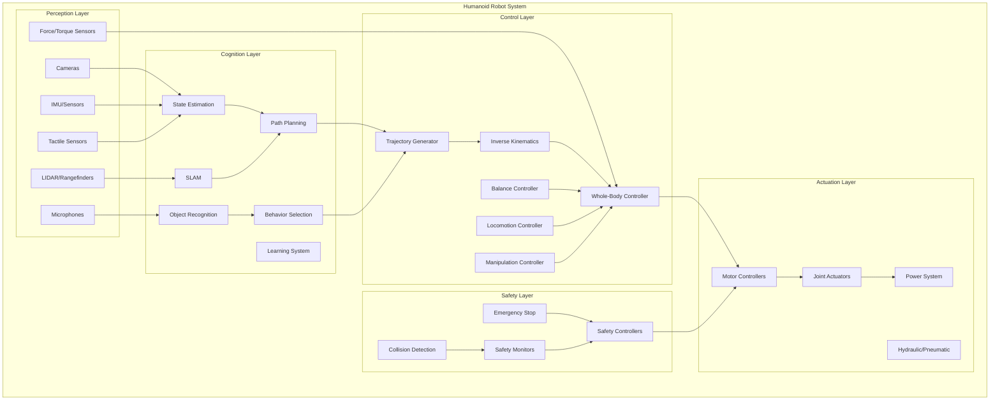
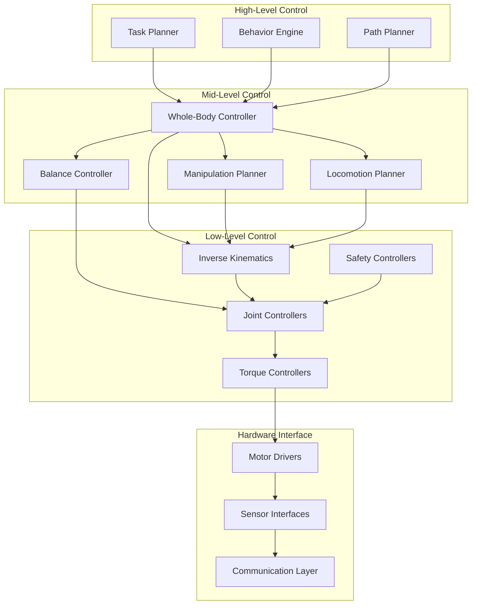
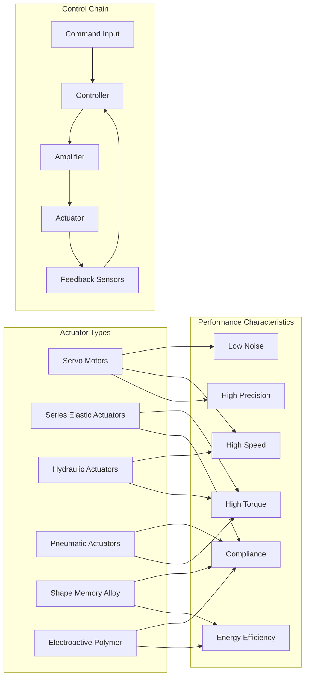
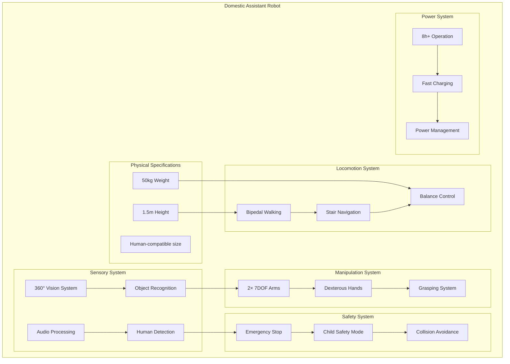
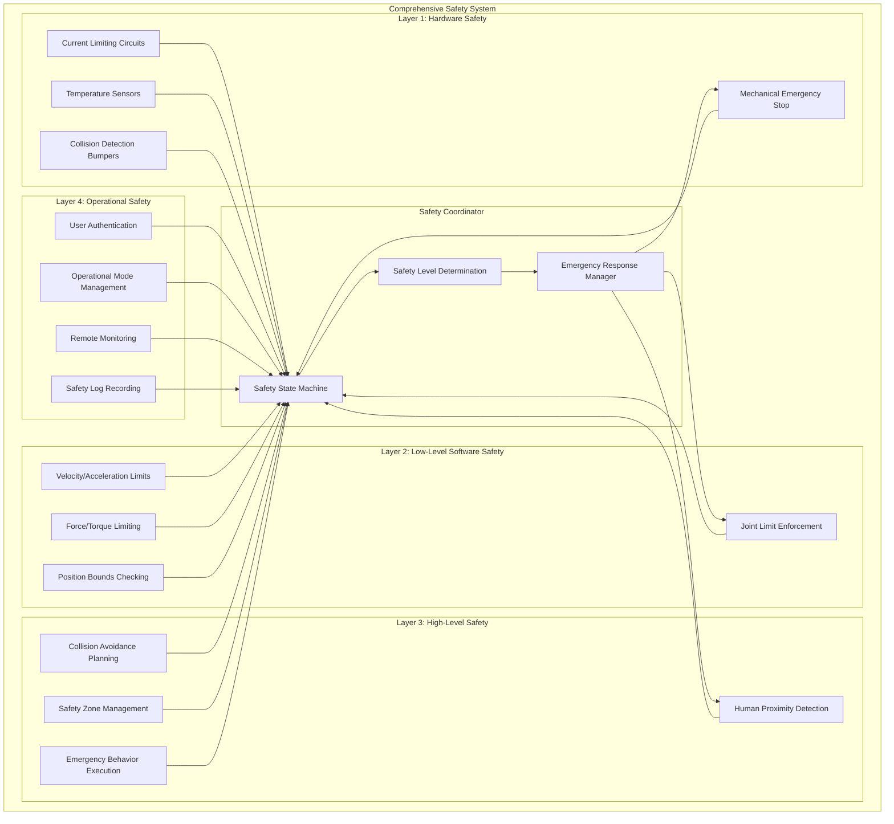
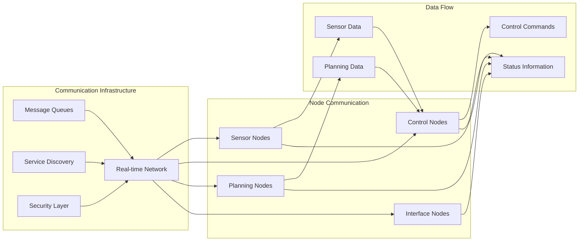

# 1.3 Humanoid Robot Design - Architecture Diagrams & Exercises

## Learning Objectives
- Visualize humanoid robot design architecture through comprehensive diagrams
- Apply design patterns to practical humanoid robot systems
- Practice design exercises for humanoid robot architecture
- Analyze system integration challenges through visual frameworks

## Humanoid Robot System Architecture

### Complete System Architecture


### Mechanical Architecture Framework
```
Humanoid Robot Mechanical Architecture:

┌─────────────────────────────────────────────────────────────┐
│                    Mechanical Framework                     │
├─────────────────────────────────────────────────────────────┤
│  ┌─────────────────┐                                        │
│  │     Head Unit   │  ←─── Sensors: Cameras, Microphones   │
│  │   (2-3 DOF)     │      Processing: Vision, Audio        │
│  └─────────────────┘                                        │
│           │                                                  │
│           ▼                                                  │
│  ┌─────────────────┐                                        │
│  │     Torso Unit  │  ←─── Core: Computer, Power, Main IMU │
│  │   (1-2 DOF)     │      Sensors: Balance, Power Status   │
│  └─────────────────┘                                        │
│         │       │                                            │
│         ▼       ▼                                            │
│  ┌─────────────┬─────────────┐                              │
│  │  Left Arm   │  Right Arm  │  ←─── 7 DOF each (Typical) │
│  │  (7 DOF)    │  (7 DOF)    │      Shoulders, Elbows,    │
│  └─────────────┴─────────────┘      Wrists, Grippers      │
│         │       │                                            │
│         ▼       ▼                                            │
│  ┌─────────────┬─────────────┐                              │
│  │   Left Leg  │  Right Leg  │  ←─── 6 DOF each (Typical) │
│  │   (6 DOF)   │  (6 DOF)   │      Hips, Knees, Ankles   │
│  └─────────────┴─────────────┘                              │
│           │                                                  │
│           ▼                                                  │
│  ┌─────────────────┐                                        │
│  │    Foot Unit    │  ←─── Force sensors, Ground contact   │
│  │   (0-2 DOF)     │      Balance, Terrain adaptation     │
│  └─────────────────┘                                        │
└─────────────────────────────────────────────────────────────┘
```

## Control Architecture Patterns

### Hierarchical Control Structure


### Whole-Body Control Architecture
```
Whole-Body Control Framework:

┌─────────────────────────────────────────────────────────────┐
│                    Whole-Body Control                       │
├─────────────────────────────────────────────────────────────┤
│  Priority Hierarchy:                                        │
│  ┌─────────────────────────────────────────────────────────┐│
│  │ Priority 1: Balance & Safety (Highest)                 ││
│  │ • Zero moment point control                            ││
│  │ • Fall prevention                                      ││
│  │ • Collision avoidance                                  ││
│  └─────────────────────────────────────────────────────────┘│
│  ┌─────────────────────────────────────────────────────────┐│
│  │ Priority 2: Task Execution (High)                      ││
│  │ • Manipulation tasks                                   ││
│  │ • Locomotion goals                                     ││
│  │ • Interaction behaviors                                ││
│  └─────────────────────────────────────────────────────────┘│
│  ┌─────────────────────────────────────────────────────────┐│
│  │ Priority 3: Comfort & Efficiency (Medium)              ││
│  │ • Natural movement patterns                            ││
│  │ • Energy optimization                                  ││
│  │ • Joint limit avoidance                                ││
│  └─────────────────────────────────────────────────────────┘│
└─────────────────────────────────────────────────────────────┘

Constraint Handling:
• Joint position limits
• Joint velocity limits
• Torque limits
• Collision avoidance
• Task-specific constraints
```

## Sensor Architecture Diagrams

### Multi-Sensor Integration
```mermaid
graph TB
    subgraph "Sensor System"
        subgraph "Proprioceptive Sensors"
            A[Joint Encoders]
            B[IMU: Accelerometer]
            C[IMU: Gyroscope]
            D[IMU: Magnetometer]
            E[Force/Torque Sensors]
            F[Motor Current Sensors]
        end

        subgraph "Exteroceptive Sensors"
            G[RGB Cameras]
            H[Depth Cameras]
            I[LIDAR]
            J[Microphones]
            K[Tactile Sensors]
            L[GPS (Outdoor)]
        end

        subgraph "Sensor Fusion"
            M[State Estimation]
            N[Object Detection]
            O[SLAM System]
            P[Human Detection]
        end
    end

    A --> M
    B --> M
    C --> M
    D --> M
    E --> M
    F --> M
    G --> N
    H --> N
    I --> O
    G --> O
    J --> P
    K --> N
    M --> Q[Control System]
    N --> Q
    O --> Q
    P --> Q
```

### Sensor Placement Strategy
```
Optimal Sensor Placement:

Head Region:
┌─────────────────────────────────────────────────────────────┐
│  Front-Facing Sensors:                                      │
│  • Stereo cameras for vision (2×)                          │
│  • Microphone array for sound localization (4-8×)          │
│  • LIDAR for 360° environment mapping (1×)                 │
│  • IMU for head orientation (1×)                           │
│  • Display for human interaction (1×)                      │
└─────────────────────────────────────────────────────────────┘

Torso Region:
┌─────────────────────────────────────────────────────────────┐
│  Central Sensors:                                           │
│  • Main IMU for body orientation (1×)                      │
│  • Pressure sensors for balance (2× - feet)                │
│  • Power system monitoring (multiple)                      │
│  • Wireless communication (1×)                             │
└─────────────────────────────────────────────────────────────┘

Limb Regions:
┌─────────────────────────────────────────────────────────────┐
│  Arm Sensors:                                               │
│  • Joint encoders (6-7 per arm)                            │
│  • Force/torque sensors (2-3 per arm)                      │
│  • Tactile sensors (fingers/hand)                          │
│  • Temperature sensors (motors)                            │
└─────────────────────────────────────────────────────────────┘
```

## Actuation Architecture

### Joint Actuation Systems


### Power Distribution Architecture
```
Power System Architecture:

┌─────────────────────────────────────────────────────────────┐
│                    Power Distribution                       │
├─────────────────────────────────────────────────────────────┤
│  Power Source:                                              │
│  ┌─────────────────────────────────────────────────────────┐│
│  │  Battery System:                                        ││
│  │  • Type: Li-Po, LiFePO4, or Fuel Cell                  ││
│  │  • Voltage: 24-48V nominal                             ││
│  │  • Capacity: 2-10 kWh depending on size                ││
│  │  • Management: Battery Management System (BMS)         ││
│  └─────────────────────────────────────────────────────────┘│
│           │                                                  │
│           ▼                                                  │
│  Power Distribution:                                        │
│  ┌─────────────────────────────────────────────────────────┐│
│  │  Distribution Board:                                    ││
│  │  • Main breaker: 100A capacity                         ││
│  │  • Individual circuits: 5-30A per joint                ││
│  │  • Power monitoring: Current, voltage, temperature     ││
│  │  • Emergency cutoff: Individual and master shutdown    ││
│  └─────────────────────────────────────────────────────────┘│
│           │                                                  │
│           ▼                                                  │
│  Load Distribution:                                         │
│  ┌─────────────────────────────────────────────────────────┐│
│  │  High Power Loads (Motors):                            ││
│  │  • Legs: 10-50A per joint (walking, balance)           ││
│  │  • Arms: 5-20A per joint (manipulation)                ││
│  │  ┌─────────────────────────────────────────────────────┐││
│  │  │  Low Power Loads (Sensors, Processors):            │││
│  │  │  • Computers: 5-15A total                          │││
│  │  │  • Sensors: 1-5A total                             │││
│  │  │  • Communication: 0.5-2A total                     │││
│  │  └─────────────────────────────────────────────────────┘││
│  └─────────────────────────────────────────────────────────┘│
└─────────────────────────────────────────────────────────────┘
```

## Design Exercise Framework

### Exercise 1: Complete Humanoid Robot Architecture Design

**Scenario**: Design a humanoid robot for domestic assistance tasks with the following requirements:
- Height: 1.5m, Weight: 50kg maximum
- Tasks: Fetching objects, basic cleaning, simple cooking assistance
- Environment: Standard home with stairs, doors, furniture
- Safety: Must be safe around children and elderly
- Operation: 8+ hours continuous operation

**Architecture Solution Framework**:



**Key Design Considerations**:
- **Size Optimization**: Balance between dexterity and structural strength
- **Safety First**: Compliant actuators and safety protocols
- **Energy Efficiency**: Optimized walking patterns and component selection
- **Task Appropriateness**: Manipulation capability for household tasks

### Exercise 2: Control System Architecture Design

**Task**: Design a control architecture for a humanoid robot that can perform both dynamic locomotion and precise manipulation simultaneously.

**Control Architecture Solution**:
```
Dual-Task Control Architecture:

┌─────────────────────────────────────────────────────────────┐
│                 Hierarchical Control System                 │
├─────────────────────────────────────────────────────────────┤
│  High-Level Planner:                                        │
│  ┌─────────────────────────────────────────────────────────┐│
│  │  Task Manager:                                         ││
│  │  • Parse high-level commands                           ││
│  │  • Coordinate manipulation and locomotion              ││
│  │  • Resolve conflicts between tasks                     ││
│  │  • Optimize for energy/safety                          ││
│  └─────────────────────────────────────────────────────────┘│
│           │                                                  │
│           ▼                                                  │
│  Mid-Level Coordinator:                                     │
│  ┌─────────────────────────────────────────────────────────┐│
│  │  Task Scheduler:                                       ││
│  │  • Allocate computational resources                    ││
│  │  • Sequence conflicting operations                     ││
│  │  • Manage task priorities                              ││
│  │  • Handle interruptions                                ││
│  └─────────────────────────────────────────────────────────┘│
│           │                                                  │
│           ▼                                                  │
│  Low-Level Controllers:                                     │
│  ┌─────────────────┐   ┌─────────────────┐                 │
│  │Manipulation     │   │Locomotion       │                 │
│  │Controller       │   │Controller       │                 │
│  │• Arm IK         │   │• Balance Control│                 │
│  │• Hand Control   │   │• Walking Gait   │                 │
│  │• Grasp Planning │   │• Foot Placement │                 │
│  └─────────────────┘   └─────────────────┘                 │
│           │                       │                          │
│           └───────────────────────┼──────────────────────────┘
│                                   ▼
│  Whole-Body Integration:
│  ┌─────────────────────────────────────────────────────────┐│
│  │  Integration Layer:                                    ││
│  │  • Combine manipulation and locomotion commands        ││
│  │  • Ensure dynamic balance during dual tasks            ││
│  │  • Optimize joint coordination                           ││
│  │  • Handle resource conflicts                             ││
│  └─────────────────────────────────────────────────────────┘│
└─────────────────────────────────────────────────────────────┘
```

### Exercise 3: Safety System Architecture

**Scenario**: Design a comprehensive safety architecture for a humanoid robot operating in human-populated environments.

**Safety Architecture Solution**:


## Architecture Pattern Exercises

### Pattern 1: Modular Component Architecture
**Exercise**: Design a modular architecture where components can be easily replaced or upgraded.

**Solution**:
```
Modular Architecture Pattern:

┌─────────────────────────────────────────────────────────────┐
│                    Modular Architecture                     │
├─────────────────────────────────────────────────────────────┤
│  Standard Interfaces:                                       │
│  ┌─────────────────────────────────────────────────────────┐│
│  │  Mechanical Interface:                                  ││
│  │  • Standard mounting points                             ││
│  │  • Quick-connect joints                                 ││
│  │  • Tool-free assembly features                          ││
│  └─────────────────────────────────────────────────────────┘│
│  ┌─────────────────────────────────────────────────────────┐│
│  │  Electrical Interface:                                  ││
│  │  • Standard power connectors                            ││
│  │  • Data communication ports                             ││
│  │  • Safety interlocks                                    ││
│  └─────────────────────────────────────────────────────────┘│
│  ┌─────────────────────────────────────────────────────────┐│
│  │  Software Interface:                                    ││
│  │  • Standard message formats                             ││
│  │  • Common service definitions                           ││
│  │  • Plug-and-play component recognition                  ││
│  └─────────────────────────────────────────────────────────┘│
│           │                                                  │
│           ▼                                                  │
│  Component Types:                                           │
│  ┌─────────────────┐  ┌─────────────────┐  ┌───────────────┐│
│  │Sensor Module    │  │Actuator Module  │  │Processing     ││
│  │• Camera         │  │• Joint Motor    │  │• Compute      ││
│  │• IMU            │  │• Drive System   │  │• Control      ││
│  │• Tactile        │  │• Feedback       │  │• Interface    ││
│  └─────────────────┘  └─────────────────┘  └───────────────┘│
└─────────────────────────────────────────────────────────────┘
```

### Pattern 2: Fail-Safe Architecture
**Exercise**: Design an architecture that ensures safe operation even when components fail.

**Solution**:
```
Fail-Safe Architecture Pattern:

┌─────────────────────────────────────────────────────────────┐
│                    Fail-Safe Architecture                   │
├─────────────────────────────────────────────────────────────┤
│  Redundancy Strategy:                                       │
│  ┌─────────────────────────────────────────────────────────┐│
│  │  Critical Systems Redundancy:                           ││
│  │  • Dual IMU systems (vote-based)                       ││
│  │  • Backup power for safety systems                     ││
│  │  • Redundant communication paths                       ││
│  │  • Multiple emergency stops                            ││
│  └─────────────────────────────────────────────────────────┘│
│           │                                                  │
│           ▼                                                  │
│  Graceful Degradation:                                      │
│  ┌─────────────────────────────────────────────────────────┐│
│  │  Operational Modes Based on Health:                     ││
│  │  • Full Operation: All systems nominal                 ││
│  │  • Degraded Mode: Reduced functionality                ││
│  │  • Safe Hold: Minimal operation, safety focus          ││
│  │  • Emergency Stop: Immediate halt                      ││
│  └─────────────────────────────────────────────────────────┘│
│           │                                                  │
│           ▼                                                  │
│  Recovery Procedures:                                       │
│  ┌─────────────────────────────────────────────────────────┐│
│  │  Automatic Recovery:                                    ││
│  │  • System health monitoring                            ││
│  │  • Automatic restart of failed components              ││
│  │  • Safe state recovery procedures                      ││
│  │  • Operator notification and manual override           ││
│  └─────────────────────────────────────────────────────────┘│
└─────────────────────────────────────────────────────────────┘
```

## System Integration Diagrams

### Communication Architecture


### Data Flow Architecture
```
Complete Data Flow Architecture:

┌─────────────────────────────────────────────────────────────┐
│                    Data Flow Architecture                   │
├─────────────────────────────────────────────────────────────┤
│  Sensing Phase:                                             │
│  ┌─────────────────┐    ┌─────────────────┐                 │
│  │Raw Sensor Data  │───▶│Preprocessing    │                 │
│  │• Camera frames  │    │• Noise removal  │                 │
│  │• IMU readings   │    │• Calibration    │                 │
│  │• Joint encoders │    │• Filtering      │                 │
│  └─────────────────┘    └─────────────────┘                 │
│           │                       │                          │
│           ▼                       ▼                          │
│  Processing Phase:                                           │
│  ┌─────────────────┐    ┌─────────────────┐                 │
│  │State Estimation │───▶│Perception      │                 │
│  │• Robot pose     │    │• Object        │                 │
│  │• Environment    │    │  detection     │                 │
│  │• Human location │    │• Scene         │                 │
│  └─────────────────┘    │  understanding │                 │
│           │              └─────────────────┘                 │
│           ▼                       │                          │
│  Decision Phase:                                             │
│  ┌─────────────────┐    ┌─────────────────┐                 │
│  │Planning         │───▶│Control          │                 │
│  │• Path planning  │    │• Trajectory     │                 │
│  │• Task planning  │    │  generation     │                 │
│  │• Motion planning│    │• Feedback       │                 │
│  └─────────────────┘    │  control        │                 │
│           │              └─────────────────┘                 │
│           ▼                       │                          │
│  Actuation Phase:                                            │
│  ┌─────────────────┐    ┌─────────────────┐                 │
│  │Command Mapping  │───▶│Hardware         │                 │
│  │• Joint angles   │    │• Motor drivers  │                 │
│  │• Forces/torques │    │• Actuator       │                 │
│  │• Sequences      │    │  interfaces     │                 │
│  └─────────────────┘    └─────────────────┘                 │
└─────────────────────────────────────────────────────────────┘
```

## Assessment Questions

1. **Architecture Exercise**: Draw the complete system architecture for a humanoid robot performing a complex task (e.g., setting a table), showing all subsystems, communication paths, and safety interlocks.

2. **Design Challenge**: Create an architectural diagram for a modular humanoid robot where limbs can be interchanged, showing the mechanical, electrical, and software interfaces required.

3. **Integration Exercise**: Design a communication architecture that can handle both real-time control data and high-bandwidth sensor data efficiently.

4. **Safety Exercise**: Design a fail-safe architecture for a humanoid robot that must operate safely around humans, showing all safety layers and their interactions.

## Performance Architecture Considerations

### Real-Time Performance Architecture
```
Real-Time Performance Architecture:

┌─────────────────────────────────────────────────────────────┐
│                  Real-Time Architecture                     │
├─────────────────────────────────────────────────────────────┤
│  Timing Requirements:                                       │
│  ┌─────────────────────────────────────────────────────────┐│
│  │  Critical Control Loops (1-10ms):                      ││
│  │  • Joint position control: 1-2ms                       ││
│  │  • Balance control: 2-5ms                              ││
│  │  • Collision avoidance: 5-10ms                         ││
│  └─────────────────────────────────────────────────────────┘│
│  ┌─────────────────────────────────────────────────────────┐│
│  │  Standard Control Loops (10-100ms):                    ││
│  │  • Trajectory following: 10-20ms                       ││
│  │  • State estimation: 20-50ms                           ││
│  │  • Path planning: 50-100ms                             ││
│  └─────────────────────────────────────────────────────────┘│
│  ┌─────────────────────────────────────────────────────────┐│
│  │  High-Level Processing (100ms-1s):                     ││
│  │  • Task planning: 200ms-1s                             ││
│  │  • Perception: 100ms-500ms                             ││
│  │  • Communication: 100ms-1s                             ││
│  └─────────────────────────────────────────────────────────┘│
│           │                                                  │
│           ▼                                                  │
│  Resource Management:                                       │
│  ┌─────────────────────────────────────────────────────────┐│
│  │  CPU Allocation:                                        ││
│  │  • Real-time threads: 80% priority                     ││
│  │  • Standard threads: 20% priority                      ││
│  │  • Memory locking: Critical data structures            ││
│  │  • Cache optimization: Frequently accessed data        ││
│  └─────────────────────────────────────────────────────────┘│
└─────────────────────────────────────────────────────────────┘
```

## Security Architecture Considerations

```
Security Architecture Framework:

┌─────────────────────────────────────────────────────────────┐
│                     Security Framework                      │
├─────────────────────────────────────────────────────────────┤
│  Physical Security:                                         │
│  • Tamper-evident design                                    │
│  • Secure component access                                  │
│  • Emergency shutdown systems                               │
├─────────────────────────────────────────────────────────────┤
│  Communication Security:                                    │
│  • Encrypted communication channels                         │
│  • Authentication protocols                                 │
│  • Network segmentation                                     │
│  • Secure boot processes                                    │
├─────────────────────────────────────────────────────────────┤
│  Software Security:                                         │
│  • Secure coding practices                                  │
│  • Input validation                                         │
│  • Memory protection                                        │
│  • Access control mechanisms                                │
└─────────────────────────────────────────────────────────────┘
```

## Summary

This section has provided comprehensive architectural diagrams and design exercises for humanoid robot systems. The visual frameworks illustrate the complex interconnections between different subsystems and provide patterns for building robust, safe, and efficient humanoid robots. The exercises provide hands-on opportunities to apply architectural concepts to real design challenges.

The key insight is that successful humanoid robot design requires careful architectural planning that considers mechanical, electrical, software, and safety aspects in an integrated manner.

## Lab Exercise: Complete Architecture Design

Design and document a complete humanoid robot architecture:

1. **System Requirements**: Define specific capabilities and constraints
2. **Mechanical Architecture**: Design the physical structure and components
3. **Control Architecture**: Design the control hierarchy and algorithms
4. **Safety Architecture**: Design comprehensive safety systems
5. **Integration Plan**: Plan how all components work together
6. **Validation Approach**: Define testing and validation methods
7. **Documentation**: Create architectural diagrams and specifications

## References & Further Reading

- Kajita, S. (2005). Humanoid Robotics
- Sardain, P., & Bessonnet, G. (2004). Forces acting on a biped robot
- Khatib, O., et al. (2018). Humanoid manipulation
- Siciliano, B., & Khatib, O. (2016). Springer Handbook of Robotics