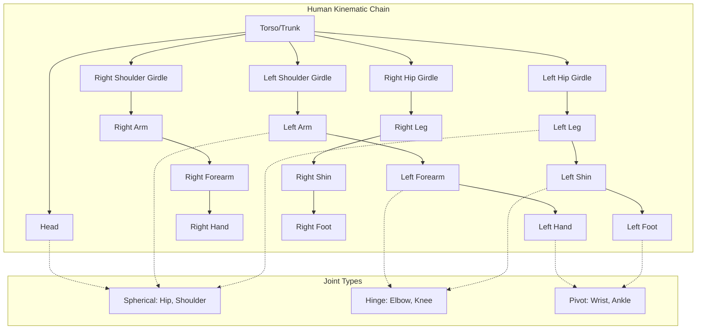
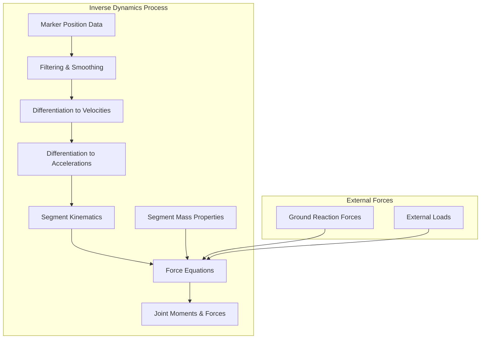
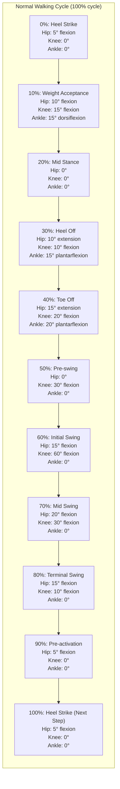
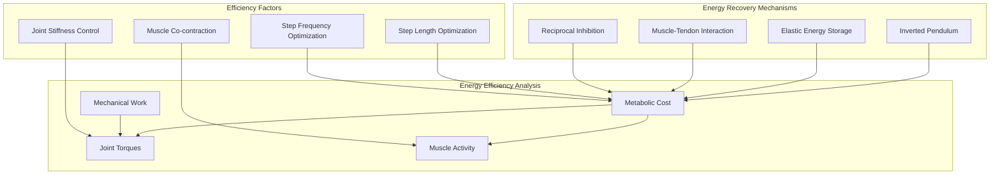
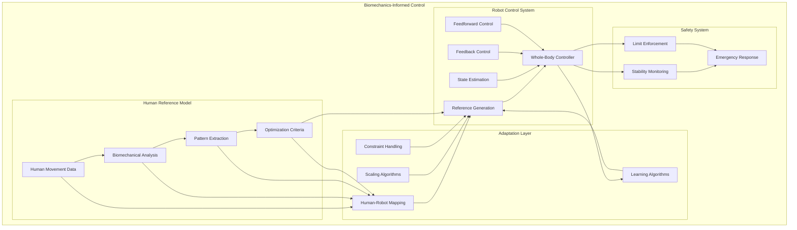

# 2.3 Biomechanics Analysis - Diagrams & Exercises

## Learning Objectives
- Visualize biomechanical principles through comprehensive diagrams
- Apply biomechanical analysis techniques to movement problems
- Practice movement analysis through interactive exercises
- Analyze human and robotic movement patterns through visual frameworks

## Human Kinematic Chain Architecture

### Complete Human Kinematic Structure


### Segment Properties and Parameters
```
Human Body Segment Parameters:

┌─────────────────────────────────────────────────────────────┐
│                    Segment Characteristics                    │
├─────────────────────────────────────────────────────────────┤
│  Head:                                                      │
│  • Mass: 7% of total body mass                              │
│  • Length: 12.5% of total height                           │
│  • COM: 50% of segment length from base                     │
│  • Moments of Inertia: Ixx=Iyy=0.007m², Izz=0.012m²        │
├─────────────────────────────────────────────────────────────┤
│  Trunk:                                                     │
│  • Mass: 50% of total body mass                             │
│  • Length: 30% of total height                             │
│  • COM: 43% of segment length from base                     │
│  • Moments of Inertia: Ixx=0.096m², Iyy=0.076m², Izz=0.037m²│
├─────────────────────────────────────────────────────────────┤
│  Upper Arm:                                                 │
│  • Mass: 2.7% of total body mass                            │
│  • Length: 18.6% of total height                           │
│  • COM: 43% of segment length from shoulder                 │
│  • Moments of Inertia: Ixx=Iyy=0.011m², Izz=0.002m²        │
├─────────────────────────────────────────────────────────────┤
│  Forearm:                                                   │
│  • Mass: 1.6% of total body mass                            │
│  • Length: 14.6% of total height                           │
│  • COM: 43% of segment length from elbow                    │
│  • Moments of Inertia: Ixx=Iyy=0.005m², Izz=0.001m²        │
├─────────────────────────────────────────────────────────────┤
│  Thigh:                                                     │
│  • Mass: 14.2% of total body mass                           │
│  • Length: 24.3% of total height                           │
│  • COM: 43% of segment length from hip                      │
│  • Moments of Inertia: Ixx=0.101m², Iyy=0.097m², Izz=0.027m²│
├─────────────────────────────────────────────────────────────┤
│  Shank:                                                     │
│  • Mass: 4.3% of total body mass                            │
│  • Length: 24.5% of total height                           │
│  • COM: 43% of segment length from knee                     │
│  • Moments of Inertia: Ixx=0.039m², Iyy=0.037m², Izz=0.009m²│
└─────────────────────────────────────────────────────────────┘
```

## Movement Analysis Frameworks

### 3D Motion Analysis Coordinate Systems
```mermaid
graph TD
    subgraph "Global Coordinate System"
        A[Global Origin: (0,0,0)]
        B[X-axis: Forward/Backward]
        C[Y-axis: Left/Right]
        D[Z-axis: Up/Down]
    end

    subgraph "Segment Coordinate Systems"
        E[Thorax CS: Origin at Mid-sternum]
        F[Pelvis CS: Origin at Mid-pelvis]
        G[Femur CS: Origin at Hip Joint Center]
        H[Tibia CS: Origin at Knee Joint Center]
        I[Hand CS: Origin at Wrist Joint Center]
    end

    subgraph "Joint Coordinate Systems"
        J[Cardan Angles: Flexion/Extension, Abduction/Adduction, Rotation]
        K[Joint Angles: Relative angles between segments]
    end

    A --> E
    A --> F
    A --> G
    A --> H
    A --> I
    E --> J
    F --> J
    G --> K
    H --> K
    I --> K
```

### Gait Analysis Framework
```
Walking Gait Analysis Framework:

┌─────────────────────────────────────────────────────────────┐
│                    Gait Analysis Framework                  │
├─────────────────────────────────────────────────────────────┤
│  Temporal-Spatial Parameters:                               │
│  ┌─────────────────────────────────────────────────────────┐│
│  │  Primary Parameters:                                    ││
│  │  • Stride Length: Distance between consecutive heel    ││
│  │    strikes of the same foot                             ││
│  │  • Step Length: Distance between opposite foot strikes ││
│  │  • Step Width: Lateral distance between feet           ││
│  │  • Cadence: Steps per minute                            ││
│  │  • Walking Speed: Distance per unit time               ││
│  └─────────────────────────────────────────────────────────┘│
│  ┌─────────────────────────────────────────────────────────┐│
│  │  Secondary Parameters:                                  ││
│  │  • Stance Phase Duration: % of gait cycle              ││
│  │  • Swing Phase Duration: % of gait cycle               ││
│  │  • Double Support Duration: % of gait cycle            ││
│  │  • Single Support Duration: % of gait cycle            ││
│  └─────────────────────────────────────────────────────────┘│
│           │                                                  │
│           ▼                                                  │
│  Kinematic Parameters:                                      │
│  ┌─────────────────────────────────────────────────────────┐│
│  │  Joint Angles:                                          ││
│  │  • Hip: Flexion/Extension, Abduction/Adduction         ││
│  │  • Knee: Flexion/Extension                              ││
│  │  • Ankle: Dorsiflexion/Plantarflexion                   ││
│  │  • Pelvis: Anterior/Posterior tilt, Lateral tilt       ││
│  │  • Trunk: Forward/Backward lean                        ││
│  └─────────────────────────────────────────────────────────┘│
│  ┌─────────────────────────────────────────────────────────┐│
│  │  Center of Mass:                                        ││
│  │  • Trajectory: 3D path during gait cycle               ││
│  │  • Velocity: Speed and direction changes               ││
│  │  • Acceleration: Dynamic changes during walking        ││
│  └─────────────────────────────────────────────────────────┘│
│           │                                                  │
│           ▼                                                  │
│  Kinetic Parameters:                                        │
│  ┌─────────────────────────────────────────────────────────┐│
│  │  Ground Reaction Forces:                                ││
│  │  • Vertical: Support body weight                        ││
│  │  • Anterior-Posterior: Propulsion and braking          ││
│  │  • Medial-Lateral: Balance control                      ││
│  └─────────────────────────────────────────────────────────┘│
│  ┌─────────────────────────────────────────────────────────┐│
│  │  Moments and Powers:                                    ││
│  │  • Joint Moments: Torques at each joint                ││
│  │  • Joint Powers: Energy generation/absorption          ││
│  │  • Work: Net energy expenditure per cycle              ││
│  └─────────────────────────────────────────────────────────┘│
└─────────────────────────────────────────────────────────────┘
```

## Biomechanical Modeling Diagrams

### Inverse Dynamics Analysis


### Multi-Link Pendulum Model
```
Human Body as Multi-Link Pendulum:

┌─────────────────────────────────────────────────────────────┐
│                    Multi-Link Pendulum Model                │
├─────────────────────────────────────────────────────────────┤
│  Single Inverted Pendulum (Simplified):                     │
│  ┌─────────────────────────────────────────────────────────┐│
│  │  • Single segment above pivot point                    ││
│  │  • CoM height: h                                       ││
│  │  • Equation: θ'' = (g/h) * sin(θ)                      ││
│  │  • Application: Basic balance control                  ││
│  └─────────────────────────────────────────────────────────┘│
│           │                                                  │
│           ▼                                                  │
│  Double Inverted Pendulum (Torsos-Legs):                    │
│  ┌─────────────────────────────────────────────────────────┐│
│  │  • Two segments: trunk and legs                        ││
│  │  • Equations: Complex coupled differential equations    ││
│  │  • Application: Walking balance control                ││
│  │  • CoM trajectories: More realistic modeling           ││
│  └─────────────────────────────────────────────────────────┘│
│           │                                                  │
│           ▼                                                  │
│  Full Human Model (17+ Segments):                           │
│  ┌─────────────────────────────────────────────────────────┐│
│  │  • Complete body representation                        ││
│  │  • 50+ degrees of freedom                              ││
│  │  • Complex musculoskeletal interactions                ││
│  │  • Application: Detailed movement analysis             ││
│  └─────────────────────────────────────────────────────────┘│
└─────────────────────────────────────────────────────────────┘

Equations of Motion:
∑F = ma (Linear motion)
∑M = Iα + ω × (Iω) (Angular motion)

Where:
F = forces acting on segment
M = moments acting on segment
m = segment mass
a = linear acceleration
I = moment of inertia tensor
α = angular acceleration
ω = angular velocity
```

## Movement Pattern Analysis

### Normal Walking Pattern Visualization


### Joint Angle Profiles During Walking
```
Joint Angle Profiles - Walking:

Hip Joint (Sagittal Plane):
┌─────────────────────────────────────────────────────────────┐
│  40° │                                                    │
│      │                                                    │
│  20° │    ╭─╮              ╭─╮              ╭─╮         │
│      │   ╱   ╲            ╱   ╲            ╱   ╲        │
│   0° │ ╭╯     ╲    ╭─╮   ╱     ╲    ╭─╮   ╱     ╲       │
│      │╱         ╲  ╱   ╲ ╱       ╲  ╱   ╲ ╱       ╲      │
│ -20° │          ╲╱     ╲╱         ╲╱     ╲╱         ╲     │
│      │           ╲      ╲          ╲      ╲          ╲    │
│ -40° └────────────────────────────────────────────────────┘
│      0%    20%    40%    60%    80%   100%              │
│                    Gait Cycle %                          │
└─────────────────────────────────────────────────────────────┘

Knee Joint (Sagittal Plane):
┌─────────────────────────────────────────────────────────────┐
│  60° │         ╭─╮              ╭─╮                      │
│      │        ╱   ╲            ╱   ╲                     │
│  40° │       ╱     ╲          ╱     ╲                    │
│      │      ╱       ╲        ╱       ╲                   │
│  20° │     ╱         ╲      ╱         ╲                  │
│      │    ╱           ╲    ╱           ╲                 │
│   0° │ ╭─╯             ╲  ╱             ╲                │
│      │╱                 ╲╱               ╲               │
│ -20° │                                    ╲              │
│      │                                     ╲             │
│ -40° └────────────────────────────────────────────────────┘
│      0%    20%    40%    60%    80%   100%              │
│                    Gait Cycle %                          │
└─────────────────────────────────────────────────────────────┘

Ankle Joint (Sagittal Plane):
┌─────────────────────────────────────────────────────────────┐
│  20° │                                                    │
│      │                                                    │
│  10° │    ╭─╮              ╭─╮              ╭─╮         │
│      │   ╱   ╲            ╱   ╲            ╱   ╲        │
│   0° │ ╭─╯   ╲─╮    ╭─╮   ╱ ╲ ╱ ╲    ╭─╮   ╱ ╲ ╱ ╲       │
│      │╱       ╲ ╲  ╱   ╲ ╱   ╲ ╲ ╲  ╱   ╲ ╱   ╲ ╲ ╲      │
│ -10° │         ╲ ╲╱     ╲╱     ╲ ╲╱     ╲╱     ╲ ╲ ╲     │
│      │          ╲ ╲      ╲      ╲ ╲      ╲      ╲ ╲ ╲    │
│ -20° │           ╲ ╲      ╲      ╲ ╲      ╲      ╲ ╲ ╲   │
│      │            ╲ ╲      ╲      ╲ ╲      ╲      ╲ ╲ ╲  │
│ -30° └────────────────────────────────────────────────────┘
│      0%    20%    40%    60%    80%   100%              │
│                    Gait Cycle %                          │
└─────────────────────────────────────────────────────────────┘
```

## Biomechanical Analysis Exercises

### Exercise 1: Gait Cycle Analysis

**Scenario**: Analyze the gait cycle of a person walking at different speeds and identify key biomechanical differences.

**Analysis Framework**:

```mermaid
graph TD
    subgraph "Gait Analysis Exercise"
        A[Slow Walking (0.5 m/s)]
        B[Normal Walking (1.3 m/s)]
        C[Fast Walking (2.0 m/s)]

        D[Step Length: 0.4m]
        E[Step Length: 0.7m]
        F[Step Length: 1.0m]

        G[Cadence: 80 steps/min]
        H[Cadence: 110 steps/min]
        I[Cadence: 140 steps/min]

        J[Joint Range: Limited]
        K[Joint Range: Normal]
        L[Joint Range: Extended]
    end

    A --> D
    A --> G
    A --> J

    B --> E
    B --> H
    B --> K

    C --> F
    C --> I
    C --> L

    D -.-> E
    E -.-> F
    G -.-> H
    H -.-> I
    J -.-> K
    K -.-> L
```

**Key Observations**:
- **Step Length**: Increases with speed (0.4m → 1.0m)
- **Cadence**: Increases with speed (80 → 140 steps/min)
- **Joint Excursions**: Greater range at higher speeds
- **Stance Time**: Decreases with speed
- **Swing Time**: Changes proportionally

### Exercise 2: Balance Control Analysis

**Task**: Analyze balance control strategies during quiet standing and perturbed conditions.

**Balance Control Framework**:
```
Balance Control Analysis:

┌─────────────────────────────────────────────────────────────┐
│                    Balance Control Strategies               │
├─────────────────────────────────────────────────────────────┤
│  Ankle Strategy (Small Perturbations):                      │
│  ┌─────────────────────────────────────────────────────────┐│
│  │  Mechanism: Ankle torque adjusts CoM over BoS          ││
│  │  Range: ±3° ankle movement                              ││
│  │  Frequency: 0.5-2 Hz                                    ││
│  │  Muscles: Soleus, gastrocnemius                         ││
│  │  Efficiency: High for small disturbances                ││
│  └─────────────────────────────────────────────────────────┘│
│           │                                                  │
│           ▼                                                  │
│  Hip Strategy (Larger Perturbations):                       │
│  ┌─────────────────────────────────────────────────────────┐│
│  │  Mechanism: Hip and trunk movement adjust CoM          ││
│  │  Range: ±8° hip movement                                ││
│  │  Frequency: 0.2-1 Hz                                    ││
│  │  Muscles: Erector spinae, iliopsoas                     ││
│  │  Efficiency: Moderate for medium disturbances           ││
│  └─────────────────────────────────────────────────────────┘│
│           │                                                  │
│           ▼                                                  │
│  Stepping Strategy (Large Perturbations):                   │
│  ┌─────────────────────────────────────────────────────────┐│
│  │  Mechanism: Step placement to expand BoS               ││
│  │  Range: Unlimited (new support base)                    ││
│  │  Frequency: Variable                                    ││
│  │  Muscles: Multiple muscle groups                        ││
│  │  Efficiency: High for large disturbances                ││
│  └─────────────────────────────────────────────────────────┘│
└─────────────────────────────────────────────────────────────┘

Control Parameters:
• Center of Pressure (CoP): Point of ground reaction force
• Center of Mass (CoM): Body's center of gravity
• Base of Support (BoS): Area bounded by feet
• Margin of Stability: Distance from CoM to BoS edge

Balance Equation: CoM displacement = CoP displacement + dynamic effects
```

### Exercise 3: Energy Efficiency Analysis

**Scenario**: Compare energy efficiency of different walking patterns and identify optimization opportunities.

**Energy Analysis Framework**:


**Energy Cost Calculations**:
```
Energy Efficiency Analysis:

Metabolic Cost Calculation:
E_metabolic = (VO₂ consumed × 20.1 J/mL O₂) / distance traveled

Typical Values:
• Normal walking: 0.9-1.0 J/kg/m
• Running: 3.5-4.0 J/kg/m
• Slow walking: 1.2-1.5 J/kg/m
• Fast walking: 1.0-1.2 J/kg/m

Mechanical Work Components:
1. External Work (Wext):
   • Work to raise/lower CoM
   • Work to accelerate/decelerate legs
   • Wext = Σ|mgh| + Σ|½mv²|

2. Internal Work (Wint):
   • Work to move body segments relative to CoM
   • Wint = Σ|½mivi²|

3. Total Mechanical Work:
   • Wtotal = Wext + Wint

Efficiency Definitions:
• Gross Efficiency: Mechanical work / Metabolic energy
• Net Efficiency: Mechanical work / (Metabolic energy - resting metabolic rate)
• Typical values: 20-25% for walking
```

## Robotics Application Diagrams

### Human-to-Robot Movement Mapping
```
Human-to-Robot Movement Mapping:

┌─────────────────────────────────────────────────────────────┐
│                 Mapping Framework                           │
├─────────────────────────────────────────────────────────────┤
│  Human Movement Capture:                                    │
│  ┌─────────────────────────────────────────────────────────┐│
│  │  • 3D marker positions                                  ││
│  │  • Joint angles                                         ││
│  │  • Ground reaction forces                               ││
│  │  • EMG signals                                          ││
│  └─────────────────────────────────────────────────────────┘│
│           │                                                  │
│           ▼                                                  │
│  Pattern Recognition:                                       │
│  ┌─────────────────────────────────────────────────────────┐│
│  │  • Gait pattern identification                          ││
│  │  • Movement primitive extraction                        ││
│  │  • Coordination pattern analysis                        ││
│  │  • Timing parameter extraction                          ││
│  └─────────────────────────────────────────────────────────┘│
│           │                                                  │
│           ▼                                                  │
│  Robot Mapping:                                             │
│  ┌─────────────────────────────────────────────────────────┐│
│  │  • Joint space transformation                          ││
│  │  • Workspace adaptation                                 ││
│  │  • Dynamic scaling                                      ││
│  │  • Constraint adaptation                                ││
│  └─────────────────────────────────────────────────────────┘│
│           │                                                  │
│           ▼                                                  │
│  Robot Execution:                                           │
│  ┌─────────────────────────────────────────────────────────┐│
│  │  • Trajectory generation                                ││
│  │  • Control implementation                               ││
│  │  • Feedback integration                                 ││
│  │  • Safety monitoring                                    ││
│  └─────────────────────────────────────────────────────────┘│
└─────────────────────────────────────────────────────────────┘

Mapping Challenges:
• Kinematic differences: Different DOF and ranges
• Dynamic differences: Different mass distributions
• Control differences: Different actuation systems
• Environmental differences: Different interaction forces
```

### Biomechanics-Informed Control Architecture


## Movement Analysis Tools

### Motion Capture Analysis Pipeline
```
Motion Capture Analysis Pipeline:

┌─────────────────────────────────────────────────────────────┐
│                    Data Acquisition                         │
├─────────────────────────────────────────────────────────────┤
│  ┌─────────────────┐  ┌─────────────────┐  ┌───────────────┐│
│  │Marker Placement │  │Data Recording   │  │Synchronization││
│  │• Anatomical     │  │• 60-120 Hz     │  │• Multiple     ││
│  │  landmarks     │  │• 3D positions   │  │  cameras      ││
│  │• Skin markers   │  │• High precision │  │• Force plates ││
│  └─────────────────┘  └─────────────────┘  └───────────────┘│
└─────────────────────────────────────────────────────────────┘
           │
           ▼
┌─────────────────────────────────────────────────────────────┐
│                    Preprocessing                            │
├─────────────────────────────────────────────────────────────┤
│  ┌─────────────────┐  ┌─────────────────┐  ┌───────────────┐│
│  │Filtering        │  │Gap Filling      │  │Coordinate     ││
│  │• Low-pass       │  │• Spline         │  │• Global       ││
│  │  filtering     │  │  interpolation  │  │  system       ││
│  │• Noise removal  │  │• Marker        │  │• Joint angles ││
│  └─────────────────┘  │  reconstruction │  └───────────────┘│
│                       └─────────────────┘                  │
└─────────────────────────────────────────────────────────────┘
           │
           ▼
┌─────────────────────────────────────────────────────────────┐
│                    Analysis                                 │
├─────────────────────────────────────────────────────────────┤
│  ┌─────────────────┐  ┌─────────────────┐  ┌───────────────┐│
│  │Kinematic        │  │Kinetic Analysis │  │EMG Integration││
│  │• Joint angles   │  │• Ground reaction│  │• Muscle       ││
│  │• Velocities     │  │  forces        │  │  activation   ││
│  │• Accelerations  │  │• Joint moments  │  │• Force        ││
│  └─────────────────┘  │• Powers         │  │  estimation   ││
│                       └─────────────────┘  └───────────────┘│
└─────────────────────────────────────────────────────────────┘
           │
           ▼
┌─────────────────────────────────────────────────────────────┐
│                    Visualization & Reporting              │
├─────────────────────────────────────────────────────────────┤
│  ┌─────────────────┐  ┌─────────────────┐  ┌───────────────┐│
│  │3D Animation     │  │Graphical        │  │Statistical    ││
│  │• Stick figures  │  │• Time series   │  │• Normal       ││
│  │• Surface models │  │• Phase plots   │  │  values      ││
│  │• Trajectories   │  │• Correlation   │  │• Deviation    ││
│  └─────────────────┘  │  analysis      │  │  analysis     ││
│                       └─────────────────┘  └───────────────┘│
└─────────────────────────────────────────────────────────────┘
```

## Assessment Questions

1. **Analysis Exercise**: Given a set of joint angle data during walking, create a complete gait analysis report including temporal-spatial parameters, kinematic patterns, and deviation from normal values.

2. **Modeling Exercise**: Design a biomechanical model for a specific movement (e.g., reaching, lifting) and identify the key parameters that would influence robotic implementation.

3. **Optimization Exercise**: Analyze the energy efficiency of a given movement pattern and propose modifications to improve efficiency while maintaining task performance.

4. **Mapping Exercise**: Create a mapping framework to translate human movement patterns to a robot with different kinematic structure, considering the constraints and capabilities of both systems.

## Rehabilitation Applications Framework

```
Rehabilitation Biomechanics Framework:

┌─────────────────────────────────────────────────────────────┐
│                    Assessment Phase                         │
├─────────────────────────────────────────────────────────────┤
│  ┌─────────────────┐  ┌─────────────────┐  ┌───────────────┐│
│  │Baseline        │  │Movement        │  │Functional      ││
│  │• Range of      │  │• Quality       │  │• Task          ││
│  │  motion       │  │• Smoothness    │  │  performance   ││
│  │• Strength      │  │• Coordination  │  │• Independence  ││
│  │• Balance       │  │• Symmetry      │  │• Safety        ││
│  └─────────────────┘  └─────────────────┘  └───────────────┘│
└─────────────────────────────────────────────────────────────┘
           │
           ▼
┌─────────────────────────────────────────────────────────────┐
│                    Intervention Phase                       │
├─────────────────────────────────────────────────────────────┤
│  ┌─────────────────┐  ┌─────────────────┐  ┌───────────────┐│
│  │Therapeutic      │  │Assistive       │  │Adaptive        ││
│  │• Exercise       │  │• Robotic       │  │• Biofeedback   ││
│  │  protocols     │  │  devices      │  │• Real-time      ││
│  │• Manual        │  │• Exoskeletons  │  │  adjustment   ││
│  │  therapy       │  │• Prosthetics   │  │• Progress      ││
│  └─────────────────┘  └─────────────────┘  │  monitoring   ││
│                                          └───────────────┘│
└─────────────────────────────────────────────────────────────┘
           │
           ▼
┌─────────────────────────────────────────────────────────────┐
│                    Evaluation Phase                         │
├─────────────────────────────────────────────────────────────┤
│  ┌─────────────────┐  ┌─────────────────┐  ┌───────────────┐│
│  │Outcome         │  │Progress        │  │Predictive      ││
│  │• Functional    │  │• Improvement   │  │• Recovery      ││
│  │  measures     │  │  tracking      │  │  modeling      ││
│  │• Pain levels   │  │• Goal          │  │• Risk          ││
│  │• Quality of    │  │  achievement   │  │  assessment    ││
│  │  life         │  └─────────────────┘  └───────────────┘│
└─────────────────────────────────────────────────────────────┘
```

## Summary

This section has provided comprehensive diagrams and analysis frameworks for understanding human biomechanics and applying these principles to robotics. The visual representations illustrate the complex relationships between different aspects of human movement, from basic kinematic chains to advanced control strategies.

The exercises and frameworks provided offer practical approaches to analyzing and implementing biomechanically-inspired robotic systems, emphasizing the importance of understanding human movement patterns for creating more natural and efficient robotic behaviors.

## Lab Exercise: Complete Movement Analysis

Conduct a complete biomechanical analysis of a movement:

1. **Data Collection**: Capture movement data using appropriate sensors
2. **Preprocessing**: Clean and prepare the data for analysis
3. **Kinematic Analysis**: Calculate joint angles and movement patterns
4. **Kinetic Analysis**: Calculate forces and moments if possible
5. **Pattern Recognition**: Identify key movement patterns
6. **Optimization**: Identify opportunities for improvement
7. **Robot Mapping**: Propose how the patterns could be implemented on a robot
8. **Validation**: Compare results with established norms

## References & Further Reading

- Winter, D. A. (2009). Biomechanics and Motor Control of Human Movement
- McGinnis, P. M. (2013). Biomechanics of Sport and Exercise
- Enoka, R. M. (2015). Neuromechanics of Human Movement
- Kautz, S. A. (2016). Biomechanics and Gait Analysis