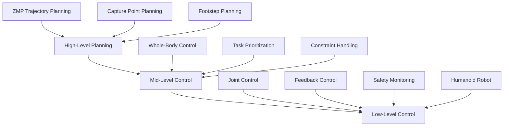
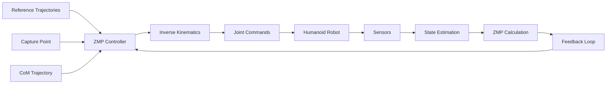
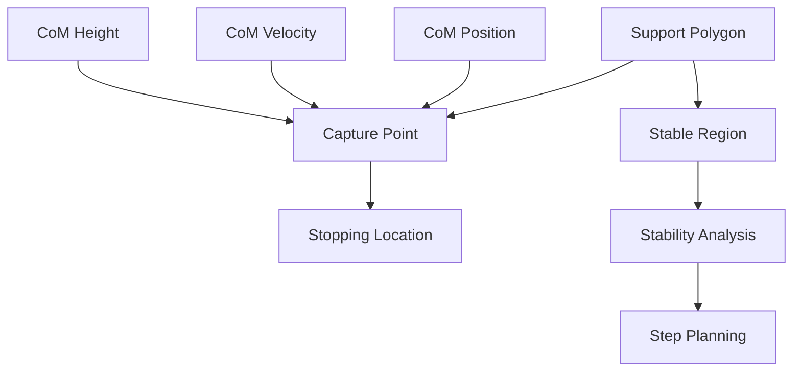
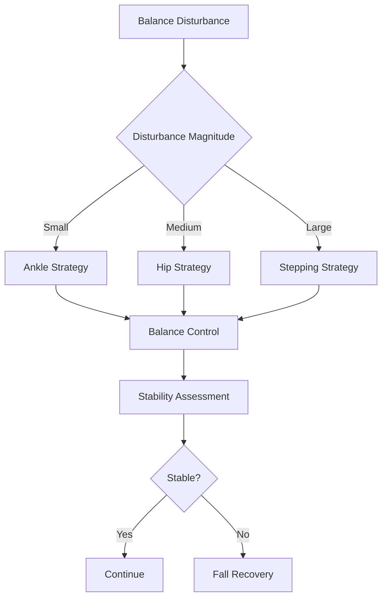
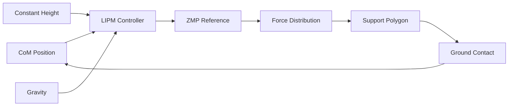
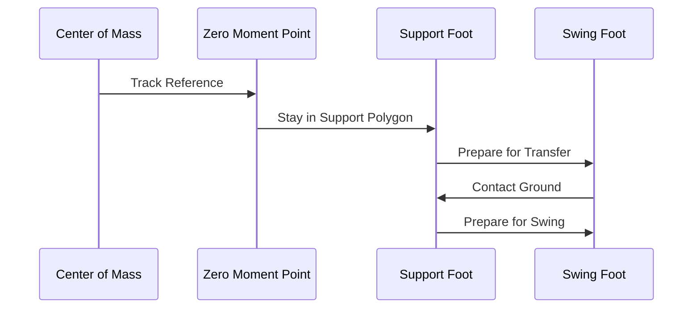
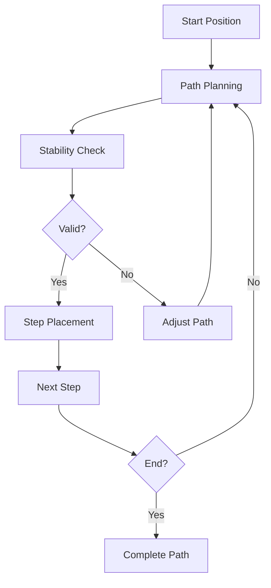
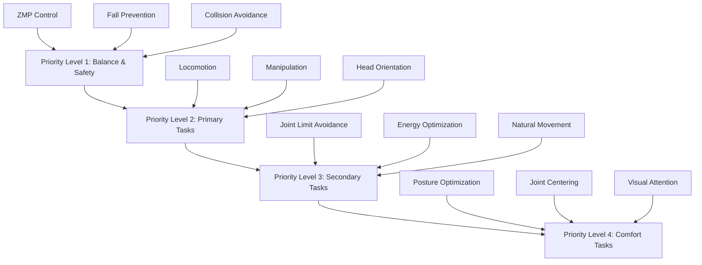
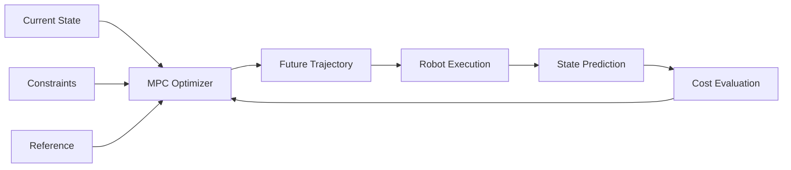

# 3.3 Balance Control and Locomotion Diagrams and Exercises

## Learning Objectives
- Visualize balance control and locomotion systems through diagrams
- Analyze real-world case studies of humanoid balance and locomotion
- Apply balance control principles through practical exercises
- Understand the relationship between theoretical concepts and practical implementation
- Evaluate different approaches to balance and locomotion through case studies

## System Architecture Diagrams

### Hierarchical Balance Control Architecture


### ZMP-Based Walking Control System


### Capture Point and Stability Regions


## Balance Control System Diagrams

### Ankle-Hip-Stepping Strategy Selection


### Linear Inverted Pendulum Model (LIPM)


## Locomotion Pattern Diagrams

### Walking Gait Phase Transitions


### Footstep Planning Algorithm


## Control Architecture Diagrams

### Whole-Body Control Hierarchy


### Model Predictive Control (MPC) Framework


## Case Study: Honda ASIMO Balance Control

### ASIMO's Multi-Level Balance System
Honda's ASIMO humanoid robot demonstrates sophisticated balance control through multiple integrated systems:

- **High-Level**: Path planning and obstacle avoidance
- **Mid-Level**: ZMP-based walking pattern generation
- **Low-Level**: Real-time balance feedback control

### Key Technical Specifications:
- **CoM Control**: Maintained within support polygon
- **Step Adjustment**: Dynamic footstep planning
- **Recovery Strategy**: Multi-modal balance recovery

## Case Study: Boston Dynamics Atlas Locomotion

### Dynamic Locomotion Capabilities
Atlas demonstrates advanced dynamic locomotion including:
- Running and jumping
- Backflips and complex maneuvers
- Terrain adaptation

### Control Architecture:
- **Model-based Control**: Precise dynamic models
- **Real-time Optimization**: Fast control updates
- **Disturbance Rejection**: Robust to external forces

## Case Study: Toyota HRP-4 Humanoid Walking

### Stable Walking Implementation
HRP-4 showcases stable walking through:
- **ZMP Control**: Precise zero moment point tracking
- **Capture Point**: Predictive balance control
- **Energy Efficiency**: Optimized gait patterns

## Practical Exercises

### Exercise 1: ZMP Stability Analysis
**Objective**: Analyze the stability of a given ZMP trajectory.

Given a humanoid robot with:
- Mass: 50 kg
- CoM height: 0.8 m
- Support polygon: Rectangle with width 0.2 m and length 0.3 m

Calculate the maximum allowable ZMP deviation from the center that maintains stability.

**Solution Framework**:
```
ZMP_stability_margin = min_distance_to_support_polygon_boundary
Required ZMP_trajectory: |ZMP(t) - ZMP_ref(t)| < ZMP_stability_margin
```

### Exercise 2: Capture Point Calculation
**Objective**: Calculate the capture point for a given CoM state.

Given:
- CoM position: [0.1, 0.05] m
- CoM velocity: [0.3, 0.1] m/s
- CoM height: 0.8 m

Calculate the capture point and determine if it lies within the support polygon.

**Solution Framework**:
```
CapturePoint = CoM_position + CoM_velocity * sqrt(h/g)
If CapturePoint within support_polygon:
    Robot can stop safely
Else:
    Step adjustment required
```

### Exercise 3: Footstep Planning
**Objective**: Plan a sequence of footsteps for stable walking.

Given:
- Starting position: (0, 0)
- Target position: (2.0, 0.5)
- Step length: 0.3 m
- Step width: 0.2 m

Plan a footstep sequence that maintains ZMP stability throughout the path.

### Exercise 4: Balance Controller Design
**Objective**: Design a feedback controller for ZMP tracking.

System dynamics:
```
ẍ = g/h * (x - zmp)
```

Design a controller u = -K * (zmp_ref - zmp_actual) to achieve stable tracking.

**Controller Design Steps**:
1. Linearize the system around the operating point
2. Design feedback gains using pole placement or LQR
3. Verify stability margins
4. Simulate response to disturbances

### Exercise 5: Walking Pattern Generation
**Objective**: Generate a complete walking pattern using LIPM.

Parameters:
- Walking speed: 0.8 m/s
- Step period: 1.0 s
- CoM height: 0.8 m

Generate:
- CoM trajectory
- ZMP reference trajectory
- Footstep locations
- Timing information

## Design Exercise: Humanoid Balance System

### Exercise: Implement a Complete Balance Control System
Design a complete balance control system for a 25-DOF humanoid robot with the following specifications:

**System Requirements**:
- Maintain balance during single support phase
- Handle external disturbances up to 100N
- Achieve step response with &lt;20% overshoot
- Maintain stability margin of >5cm

**Design Tasks**:
1. **Architecture Design**: Create the control architecture diagram
2. **Controller Design**: Design ZMP and CoM controllers
3. **Sensor Integration**: Specify sensor requirements and placement
4. **Safety Features**: Implement fail-safe mechanisms
5. **Performance Metrics**: Define evaluation criteria

**Implementation Steps**:
1. Model the humanoid robot dynamics
2. Design the control hierarchy
3. Simulate the system response
4. Validate stability margins
5. Test disturbance rejection capabilities

## Challenge Problems

### Problem 1: Multi-Contact Balance
Design a balance control system for a humanoid robot that can use hands for support (e.g., wall walking, climbing).

### Problem 2: Variable Terrain Adaptation
Create an adaptive balance control system that adjusts to different ground conditions (slippery, uneven, soft surfaces).

### Problem 3: Human-Robot Interaction
Design a balance control system that maintains stability during physical interaction with humans.

## Laboratory Exercises

### Exercise: Gazebo Simulation Setup
1. Create a humanoid robot model in Gazebo
2. Implement ZMP-based balance control
3. Test response to external disturbances
4. Validate capture point calculations

### Exercise: ROS2 Integration
1. Implement ROS2 nodes for balance control
2. Create publisher/subscriber architecture
3. Integrate sensor data processing
4. Test real-time performance

## Design Considerations

### Computational Efficiency
- Real-time constraints: 200-1000 Hz control frequency
- Optimization algorithms must converge quickly
- Memory usage optimization for embedded systems

### Robustness Requirements
- Model uncertainty handling
- Sensor noise filtering
- Actuator limitations consideration
- Failure mode detection and recovery

### Safety Constraints
- Joint limit enforcement
- Collision avoidance integration
- Emergency stop procedures
- Human safety protocols

## Summary
This section provided comprehensive diagrams, case studies, and exercises for balance control and locomotion in humanoid robots. The diagrams illustrate the hierarchical control architectures, while the case studies showcase real-world implementations. The exercises provide practical applications of the theoretical concepts covered in the concepts and practical sections.

Understanding these visual representations and practical applications is crucial for implementing effective balance control and locomotion systems in humanoid robots.

## Key Takeaways
- Balance control requires hierarchical control architectures
- ZMP and capture point theories are fundamental to stable locomotion
- Real-world implementations require integration of multiple systems
- Practical exercises help solidify theoretical understanding
- Case studies provide insights into successful implementations

## References
- Kajita, S. (2005). Humanoid Robotics
- Pratt, J., & Tedrake, R. (2006). On Limit Cycles and Trajectory Tracking
- Hof, A. L., et al. (2010). The principles of full body center of mass control
- Wieber, P. B. (2006). Pattern generators with sensory feedback for the control of stance and gait